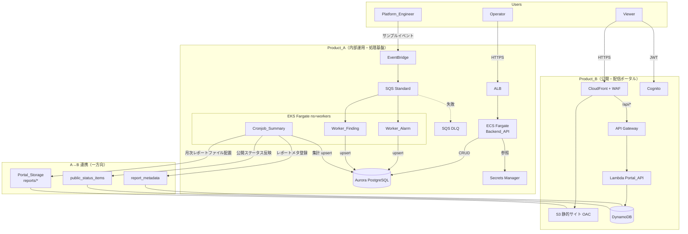
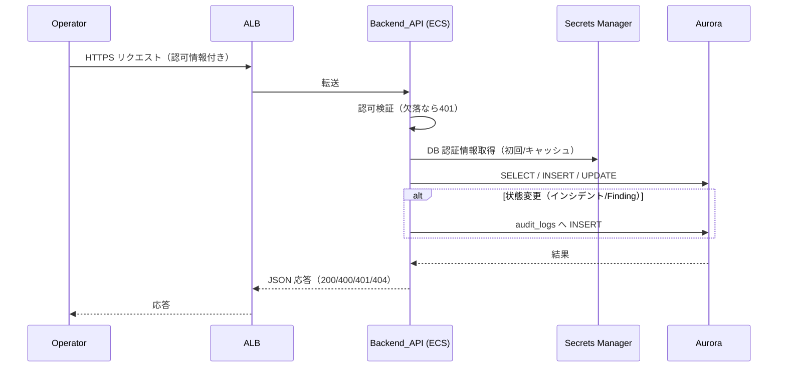
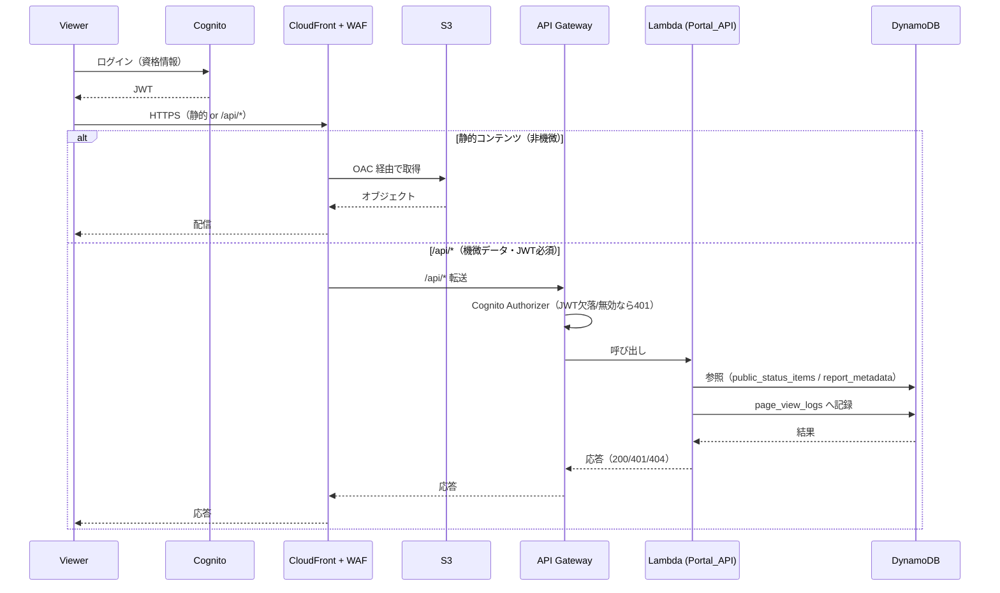
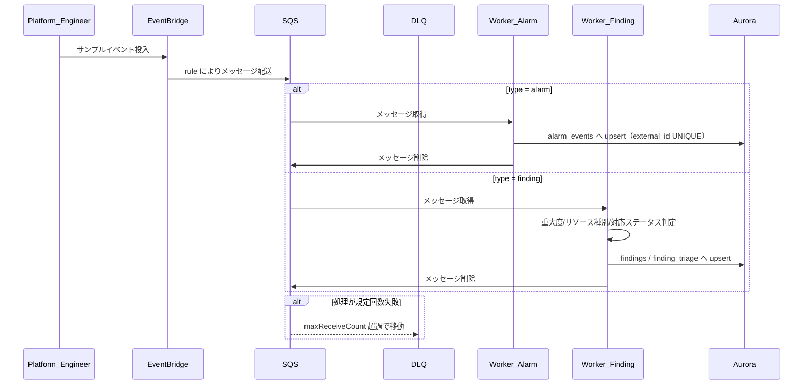
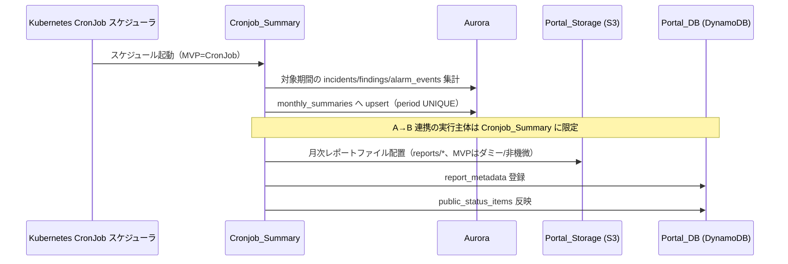
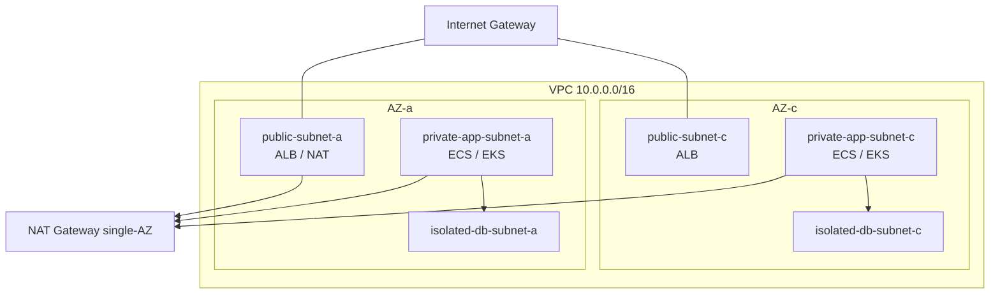
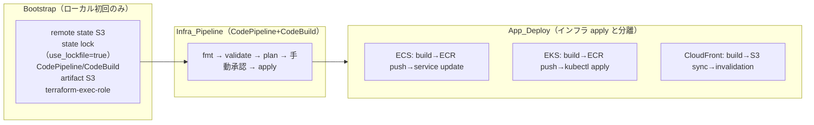

# Design Document

## Overview

本設計は、要件定義書（Requirement 1〜26）に基づき、疎結合な2つの成果物を AWS 上に構築するための技術設計を定義する。

- **Product_A（内部運用・処理基盤）**: ECS Fargate による同期 API、EKS による非同期ワーカー/CronJob、Aurora PostgreSQL によるデータ永続化で構成する内部運用基盤。社内運用担当者（Operator）がインシデント・アラーム・セキュリティ Finding・対応履歴・月次集計を管理する。
- **Product_B（公開・配信ポータル）**: CloudFront + S3(OAC) + WAF + Cognito + API Gateway + Lambda + DynamoDB で構成する軽量な公開ポータル。関係者（Viewer）が障害ステータス・メンテナンス情報・月次レポートを閲覧する。

2つの成果物は単一システムへ統合せず、**A→B の一方向・非同期連携のみ**を許容する（Requirement 1, 14）。Product_A が月次レポートファイルを Portal_Storage(S3) へ配置し、メタ情報および公開ステータスを Portal_DB(DynamoDB) へ登録する。Product_B から Product_A への書き込み・同期呼び出しは行わない。

### 設計方針

- **環境**: dev 環境 MVP 優先。商用運用を意識したネットワーク・IAM・ログ・監視・セキュリティ・IaC 設計を反映する。
- **リージョン**: `ap-northeast-1`（Requirement 19.3）。
- **命名規則**: `ops-platform-dev-<resource>`（project=`ops-platform`、env=`dev`）（Requirement 19.1）。
- **タグ**: 全リソースへ Platform 識別タグを付与（Requirement 19.2）。
- **セキュリティ**: IAM 最小権限、Security Group 最小、S3 public access block 有効、シークレット直書き禁止（Requirement 16, 17）。
- **コスト**: コスト影響が大きいリソースには代替案を明記し、plan で明示する（Requirement 23, 24）。
- **設計理由**: 各主要設計判断の理由を本文書に文章化する（Requirement 26.2）。

### MVP スコープの明確化

| 項目 | MVP での扱い |
| --- | --- |
| Product_A MVP 必須成果物 | Backend API + Swagger/OpenAPI（FastAPI 自動生成） |
| 内部運用管理画面 UI | 後続 Phase / 任意拡張（MVP 非必須） |
| ECS Auto Scaling / EKS HPA | 設計に含有するが MVP では無効/最小/非必須（Requirement 25） |
| 独自ドメイン + ACM 証明書 | 後続 Phase（MVP では CloudFront デフォルトドメイン） |
| Product_B レポートファイル | **MVP ではダミー/非機微情報のみ**（機微レポートは後続 Phase で署名付きアクセス） |

---

## 推奨構成（スペック値の詳細再整理）

| コンポーネント | サービス | 主要スペック（dev/MVP） | 拡張余地 |
| --- | --- | --- | --- |
| Backend_API | ECS Fargate | desired_count=1, CPU=0.25 vCPU(256), Memory=512MB〜1GB | Auto Scaling は設計含有・MVP 無効/最小（Req 25.1/25.2） |
| EKS ワーカー基盤 | EKS（Fargate Profile を第一候補） | namespace=`workers`、ワーカー3種（Worker_Alarm / Worker_Finding / Cronjob_Summary） | HPA は設計含有・MVP 非必須（Req 25.3/25.4） |
| Aurora_DB | Aurora Serverless v2 (PostgreSQL) | **Writer 1 台、Reader なし、最小 ACU=0.5 / 最大 ACU=2** | 本番拡張で Reader 追加・バックアップ・Performance Insights |
| Portal_API | Lambda (Python) | 256〜512MB, timeout=10s | 同時実行制御・プロビジョンドコンカレンシー |
| Portal_DB | DynamoDB | PAY_PER_REQUEST, TTL 有効, GSI は必要時 | オンデマンド→プロビジョンド切替 |
| Portal_CDN | CloudFront | **PriceClass_200** | PriceClass_All / 独自ドメイン+ACM |
| 非同期経路 | SQS Standard + DLQ | maxReceiveCount 超過で DLQ 移動 | FIFO / 複数キュー分割 |
| 共通 | — | ap-northeast-1 / env=dev / 命名規則 / タグ | prod/staging 追加 |

### Aurora 構成に関する設計判断

Aurora Serverless v2 のストレージは AWS の基盤仕様上、複数 AZ にまたがって冗長化される。したがって「single-AZ 相当」という表現は誤解を生むため用いない。dev/MVP では **Writer インスタンス 1 台のみ・Reader なし・最小 ACU=0.5** のコスト最小構成とする。本番拡張時には Reader 追加、自動バックアップ、Performance Insights、Multi-AZ 可用性強化を検討する（Requirement 24.3/24.4、非スコープ参照）。コスト制約を超える場合の代替案として RDS PostgreSQL（db.t4g.micro 相当）を提示する。

### CloudFront Price Class に関する設計判断

Viewer は主に日本国内を想定するため、日本を含むアジア・北米・欧州のエッジロケーションをカバーしつつコストを抑える **PriceClass_200** を採用する。全リージョンを使う PriceClass_All よりコストが低く、日本の Viewer に対する表示性能とコストのバランスが最も良い。コスト最小化を最優先する場合の代替案として、対象エッジを絞る **PriceClass_100** を明記する（Requirement 24.6）。

### EKS マニフェスト管理方式に関する設計判断

MVP 推奨は**素の Kubernetes manifest（`kubectl apply`）**とする。理由: ワーカーが少数（3 種）かつ dev 単一環境であり、Helm による抽象化よりも manifest の透明性・学習容易性・デバッグ容易性が勝るため。拡張として、環境が増加（staging/prod 追加）した時点で Helm chart 化へ移行する（Requirement 22.3）。

---

## Architecture

### システム全体図



> **設計上の重要点（Feedback 6 反映）**: A→B 連携の実行主体は MVP では **`monthly-summary-cronjob`（Cronjob_Summary）に限定**する。Backend_API から Portal_DB / Portal_Storage へ直接書き込む経路は MVP では持たない。上図に Backend_API から DynamoDB/S3 への矢印は存在しない。

### 分離の設計思想

Product_A と Product_B は要件（Requirement 1.1, 1.5）に従い、単一システムへ統合しない。Product_A は「状態を持ち処理を行う内部基盤」、Product_B は「静的・軽量・公開の閲覧ポータル」という性質の異なる 2 系統であり、独立してビルド・デプロイ・スケール・障害対応できるようにするため疎結合とする。連携は A→B の一方向データ受け渡し（Requirement 14.3）に限定し、Product_B から Product_A への書き込みは設計上排除する。

### ECS / EKS / CloudFront を分ける理由（3 基盤の性質の違い）

- **ECS Fargate（同期 API）**: リクエスト/レスポンス型の低レイテンシ処理。常駐サービスとして ALB 配下に配置し、シンプルなコンテナ実行に最適。運用負荷が低い。
- **EKS（非同期ワーカー/CronJob）**: キュー駆動の非同期処理・定期ジョブ・複数種ワーカーのオーケストレーションに適する。Kubernetes の Job/CronJob/Deployment 抽象を活かす。実運用に近いイベント駆動処理を再現する目的。
- **CloudFront（公開配信）**: エッジ配信・静的コンテンツ・WAF によるエッジ保護に特化。Product_B の公開性・低コスト配信を担う。

3 者は「同期 API」「非同期処理基盤」「エッジ配信」という異なる責務を持つため、それぞれ最適なサービスに割り当てて分離する。

### ECS と EKS の役割分担

| 観点 | ECS Fargate（Backend_API） | EKS（ワーカー群） |
| --- | --- | --- |
| 処理形態 | 同期（HTTP リクエスト/レスポンス） | 非同期（SQS 駆動）＋定期（CronJob） |
| トリガー | Operator の API 呼び出し | EventBridge→SQS メッセージ / スケジュール |
| 主な対象 | ダッシュボード/インシデント/Finding/月次集計 API | alarm_events 取込 / findings 分類 / 月次集計生成 |
| スケール | ECS Auto Scaling（設計含有・MVP 最小） | HPA（設計含有・MVP 非必須） |
| データ書き込み | Aurora（運用データ） | Aurora（取込・集計）＋ A→B 連携（Cronjob_Summary のみ） |

---

## 成果物A（Product_A）のAWS構成

### コンポーネント一覧

| コンポーネント | サービス | 役割 |
| --- | --- | --- |
| Backend_API | ECS Fargate + ALB | 同期 REST API（FastAPI + OpenAPI） |
| Worker_Alarm | EKS Deployment `alarm-event-processor` | アラーム風イベント取込 |
| Worker_Finding | EKS Deployment `security-finding-worker` | Finding 分類・登録 |
| Cronjob_Summary | EKS CronJob `monthly-summary-cronjob` | 月次集計生成＋A→B 連携実行主体 |
| Event_Bus | EventBridge | サンプルイベント入口 |
| Message_Queue | SQS Standard + DLQ | 非同期メッセージング |
| Aurora_DB | Aurora Serverless v2 (PostgreSQL) | 運用データ永続化 |
| Secrets | Secrets Manager | DB 認証情報等の管理 |

### Backend_API

- **実装**: Python FastAPI。OpenAPI(Swagger) を自動生成・公開（MVP 必須成果物、Requirement 26）。
- **配置**: ALB → Target Group → ECS Service（private subnet）。
- **タスク定義**: CPU=256 / Memory=512（拡張余地あり、Requirement 24.2）。
- **シークレット**: Secrets Manager 参照（環境変数直書き禁止、Requirement 16.1/16.2）。

#### 提供 API 一覧

| メソッド/パス | 概要 | 主なエラー | 対応要件 |
| --- | --- | --- | --- |
| GET /dashboard/summary | インシデント/Finding 件数・ステータス別集計 | 401 | Req 2 |
| GET /incidents | インシデント一覧 | 401 | Req 3.1 |
| GET /incidents/{id} | インシデント詳細＋コメント | 401, 404 | Req 3.2, 3.3 |
| POST /incidents | インシデント作成 | 400, 401 | Req 3.4, 3.5 |
| PATCH /incidents/{id}/status | ステータス更新＋監査記録 | 401, 404 | Req 3.6, 8.3 |
| GET /findings | Finding 一覧 | 401 | Req 4.1 |
| GET /findings/{id} | Finding 詳細＋triage | 401, 404 | Req 4.2, 4.3 |
| GET /summaries/{yyyymm} | 月次集計取得 | 401, 404 | Req 5.1, 5.2 |

### EKS ワーカー

- **Worker_Alarm**（`alarm-event-processor`, Deployment）: SQS からアラーム風イベントを取得し `alarm_events` へ登録。処理完了メッセージを削除（Requirement 6.2, 6.5）。
- **Worker_Finding**（`security-finding-worker`, Deployment）: Finding 風イベントの重大度・リソース種別・対応ステータスを判定し `findings` / `finding_triage` へ登録（Requirement 6.3）。
- **Cronjob_Summary**（`monthly-summary-cronjob`, Kubernetes CronJob）: 対象期間の集計を生成し `monthly_summaries` へ upsert。**さらに A→B 連携（Portal_Storage/Portal_DB への反映）の実行主体**（Requirement 7, 14）。

### Aurora_DB

- Aurora Serverless v2 (PostgreSQL)、**Writer 1 台・Reader なし・最小 ACU=0.5/最大 ACU=2**（Requirement 24.3）。
- isolated-db subnet に配置し、許可されたアプリケーションコンポーネントからのみ接続可能とする（Requirement 15.4）。

---

## 成果物B（Product_B）のAWS構成

### コンポーネント一覧

| コンポーネント | サービス | 役割 |
| --- | --- | --- |
| Portal_CDN | CloudFront (PriceClass_200) + WAF | HTTPS 配信・エッジ保護 |
| Portal_Storage | S3（public access block + OAC） | 静的サイト/レポートファイル格納 |
| Auth_Service | Cognito | Viewer 認証・JWT 発行 |
| Portal_API | API Gateway + Lambda | 軽量 API（JWT 保護） |
| Portal_DB | DynamoDB(4 テーブル) | ステータス/レポートメタ/閲覧ログ/メンテ情報 |

### 配信とオリジン保護

- CloudFront は 2 オリジン構成: (1) S3(OAC) を REST オリジンとする静的コンテンツ、(2) `/api/*` を API Gateway へルーティング（Requirement 12.1, 12.4）。
- S3 は public access block を有効化し、CloudFront の OAC 経由のみ許可（それ以外の要求は拒否）（Requirement 12.2, 12.3）。

### 認証方式（MVP）

- MVP は「静的配信は CloudFront+S3、機微データは API 側で Cognito JWT 保護」を基本とする（Requirement 9, 10, 11）。
- Portal_API は有効な JWT を伴わない要求に HTTP 401 を返す（Requirement 9.3）。

### レポートファイルのアクセス制御（Feedback 1 反映）

- **MVP 方針**: 静的 HTML/JS は CloudFront+S3 で配信、機微データ（レポート本体を含む）は API Gateway+Cognito JWT で保護する。
- **重要**: 月次レポート PDF/CSV 等が「CloudFront URL を知っているだけで閲覧できる」構成にはしない。
- **MVP の制約**: レポートファイルは**ダミー/非機微情報のみ**を扱う。
- **後続 Phase**: 機微レポートを扱う場合は、CloudFront **signed URL / signed cookie**、または **API 経由の署名付き URL 発行**（Lambda が JWT 検証後に S3 pre-signed URL を発行）を導入する。
- 詳細はセキュリティ設計セクションおよび A→B 連携セクションにも反映する。

### A→B 連携（Feedback 6 反映）

- **実行主体**: MVP では **`monthly-summary-cronjob`（Cronjob_Summary）に限定**する。
- Cronjob_Summary が月次レポートを確定すると、レポートファイルを Portal_Storage(`reports/*`)、メタ情報を `report_metadata`、公開ステータスを `public_status_items` へ反映する（Requirement 14.1, 14.2）。
- **Backend_API から Portal_DB / Portal_Storage への直接書き込み経路は持たない**。Requirement 14.2「公開ステータス更新」は、MVP では集計ジョブ（Cronjob_Summary）経由で担う形に読み替える。
- 連携は一方向データ受け渡しであり、Product_B から Product_A への書き込みは行わない（Requirement 14.3）。

---

## Components and Interfaces

### Product_A API インターフェース

- 認証: 全 API で認可情報必須。欠落時は 401（Requirement 2.3, 9 相当の内部認可）。
- `GET /dashboard/summary` → `{ incident_count, finding_count, status_breakdown{} }`。
- `GET /incidents` / `GET /incidents/{id}`（404 あり）/ `POST /incidents`（400＋欠落項目）/ `PATCH /incidents/{id}/status`（404、監査記録）。
- `GET /findings` / `GET /findings/{id}`（404 あり）。
- `GET /summaries/{yyyymm}`（404 あり）。

### Product_B API インターフェース

- `GET /api/status` → public_status_items 一覧（JWT 必須、閲覧記録）。
- `GET /api/status/{id}` → 障害詳細（JWT 必須、閲覧記録）。
- `GET /api/reports` → report_metadata 一覧（JWT 必須）。
- `GET /api/reports/{id}` → メタ情報＋レポートファイル参照情報（404 あり、JWT 必須）。
- JWT 欠落/無効時は 401（Requirement 9.3）。

### イベント処理インターフェース

- EventBridge rule → SQS へ配送（Requirement 6.1）。
- SQS メッセージの `type` により Worker_Alarm / Worker_Finding が処理を分岐。
- maxReceiveCount 超過メッセージは DLQ へ移動（Requirement 6.4）。
- 処理完了メッセージは SQS から削除（Requirement 6.5）。

---

## Data Models

### Aurora PostgreSQL（7 テーブル）

```sql
-- incidents: インシデント本体
CREATE TABLE incidents (
    id              BIGSERIAL PRIMARY KEY,
    external_id     TEXT UNIQUE,              -- 外部由来ID。冪等取込のためUNIQUE
    title           TEXT NOT NULL,
    severity        TEXT NOT NULL,
    status          TEXT NOT NULL DEFAULT 'open',
    description     TEXT,
    created_at      TIMESTAMPTZ NOT NULL DEFAULT now(),
    updated_at      TIMESTAMPTZ NOT NULL DEFAULT now()
);

-- incident_comments: 対応履歴
CREATE TABLE incident_comments (
    id              BIGSERIAL PRIMARY KEY,
    incident_id     BIGINT NOT NULL REFERENCES incidents(id) ON DELETE CASCADE,
    author          TEXT NOT NULL,
    body            TEXT NOT NULL,
    created_at      TIMESTAMPTZ NOT NULL DEFAULT now()
);

-- findings: セキュリティFinding
CREATE TABLE findings (
    id              BIGSERIAL PRIMARY KEY,
    external_id     TEXT UNIQUE,              -- 冪等登録のためUNIQUE
    title           TEXT NOT NULL,
    severity        TEXT NOT NULL,
    resource_type   TEXT,
    status          TEXT NOT NULL DEFAULT 'new',
    created_at      TIMESTAMPTZ NOT NULL DEFAULT now(),
    updated_at      TIMESTAMPTZ NOT NULL DEFAULT now()
);

-- finding_triage: Finding判定情報
CREATE TABLE finding_triage (
    id              BIGSERIAL PRIMARY KEY,
    finding_id      BIGINT NOT NULL REFERENCES findings(id) ON DELETE CASCADE,
    triage_status   TEXT NOT NULL,
    assessed_severity TEXT NOT NULL,
    note            TEXT,
    created_at      TIMESTAMPTZ NOT NULL DEFAULT now()
);

-- alarm_events: アラームイベント取込
CREATE TABLE alarm_events (
    id              BIGSERIAL PRIMARY KEY,
    external_id     TEXT UNIQUE,              -- 冪等取込のためUNIQUE
    source          TEXT NOT NULL,
    event_type      TEXT NOT NULL,
    payload         JSONB,
    received_at     TIMESTAMPTZ NOT NULL DEFAULT now()
);

-- monthly_summaries: 月次集計
CREATE TABLE monthly_summaries (
    id              BIGSERIAL PRIMARY KEY,
    period          TEXT UNIQUE NOT NULL,     -- 'YYYYMM'。同一年月はupsert
    incident_count  INTEGER NOT NULL,
    finding_count   INTEGER NOT NULL,
    alarm_count     INTEGER NOT NULL,
    detail          JSONB,
    generated_at    TIMESTAMPTZ NOT NULL DEFAULT now()
);

-- audit_logs: 監査ログ
CREATE TABLE audit_logs (
    id              BIGSERIAL PRIMARY KEY,
    entity_type     TEXT NOT NULL,           -- 'incident' | 'finding'
    entity_id       BIGINT NOT NULL,
    action          TEXT NOT NULL,           -- 'status_change' 等
    before_value    JSONB,
    after_value     JSONB,
    actor           TEXT,
    created_at      TIMESTAMPTZ NOT NULL DEFAULT now()
);
```

**設計判断**:
- `external_id UNIQUE`: EventBridge→SQS 経由の再配送に対する冪等取込を保証（Requirement 6.2, 6.3）。
- `monthly_summaries.period UNIQUE`: 同一年月の再集計を upsert で反映（Requirement 7.2）。
- `audit_logs`: インシデント/Finding の状態変更を必ず記録（Requirement 3.6, 8.3）。

### DynamoDB（4 テーブル、全 PAY_PER_REQUEST）

| テーブル | PK / SK | 補足 | 対応要件 |
| --- | --- | --- | --- |
| `public_status_items` | PK: `status_id` | 障害ステータス一覧/詳細 | Req 10.1, 10.2, 14.2 |
| `report_metadata` | PK: `report_id`、GSI `gsi_period`(period) | 月次レポートメタ | Req 11.1, 11.2, 14.1 |
| `page_view_logs` | PK: `view_id`、TTL 有効 | 閲覧記録（一定期間後自動削除） | Req 10.3 |
| `maintenance_windows` | PK: `window_id`、TTL 有効 | メンテナンス情報 | Req 10（付随） |

**設計判断**:
- 全テーブル PAY_PER_REQUEST（Requirement 24.5）。トラフィックが小さく予測困難な dev 環境でオンデマンド課金がコスト効率的。
- `report_metadata` の GSI `gsi_period`: 年月での一覧・絞り込みを効率化（Requirement 11.1）。
- `page_view_logs` / `maintenance_windows` は TTL でストレージコストを抑制。

---

## Correctness Properties

*プロパティとは、システムのすべての有効な実行にわたって成立すべき特性・振る舞いであり、システムが何をすべきかについての形式的な言明である。プロパティは人間が読める仕様と機械で検証可能な正しさの保証との橋渡しとなる。*

本セクションのプロパティは Product_A の純粋なビジネスロジック（集計・入力検証・冪等取込・判定・監査記録）および命名規則を対象とする。AWS マネージドサービスの挙動やインフラ配線（EventBridge→SQS 配送、DLQ 移動、Cognito 認証、CloudFront/OAC 配信、WAF、IAM/ネットワーク構成）は PBT の対象外とし、統合テスト・スナップショットテスト・構成検証で扱う（Testing Strategy 参照）。

### Property 1: ダッシュボード集計整合性

*For any* インシデント集合および Finding 集合について、ダッシュボード集計が返す incident_count は当該インシデント集合の件数と一致し、finding_count は当該 Finding 集合の件数と一致し、ステータス別集計の各値の合計は総件数と一致しなければならない。

**Validates: Requirements 2.1**

### Property 2: 認可欠落時 401

*For any* 保護された Backend_API エンドポイントおよび有効な認可情報を伴わない任意のリクエストについて、Backend_API は常に HTTP 401 応答を返さなければならない。

**Validates: Requirements 2.3**

### Property 3: 作成/更新ラウンドトリップ

*For any* 必須項目を満たした有効なインシデント入力について、作成後に同一 ID で取得すると、取得結果は作成時に指定した内容と一致しなければならない（書き込みは永続化され、読み戻せる）。

**Validates: Requirements 3.4, 8.2**

### Property 4: 未登録識別子への参照は常に 404

*For any* Aurora_DB / Portal_DB に存在しない任意の識別子（インシデント ID・Finding ID・年月・レポート ID）について、当該識別子を指定した参照 API は常に HTTP 404 応答を返さなければならない。

**Validates: Requirements 3.3, 4.3, 5.2, 11.3**

### Property 5: 必須項目欠落は 400＋欠落項目提示

*For any* 有効なインシデント入力から必須項目の空でない部分集合を取り除いた入力について、インシデント作成 API は常に HTTP 400 応答を返し、かつエラー内容には取り除かれた各必須項目が欠落項目として含まれなければならない。

**Validates: Requirements 3.5**

### Property 6: 状態変更は監査ログ記録

*For any* 登録済みインシデントまたは Finding と、その任意の有効な状態変更について、状態変更操作の後に audit_logs のレコード件数はちょうど 1 件増加し、変更前後の値が記録されなければならない。

**Validates: Requirements 3.6, 8.3**

### Property 7: アラームイベント取込冪等性

*For any* アラーム風イベントについて、同一イベント（同一 external_id）を 1 回処理した場合と 2 回以上処理した場合とで、alarm_events テーブルの当該レコードは同一であり、レコード件数は増加してはならない。

**Validates: Requirements 6.2**

### Property 8: Finding 判定妥当性と冪等登録

*For any* Finding 風イベントについて、Worker_Finding による判定結果（重大度・対応ステータス）は許容される値域に収まり、findings と finding_triage は整合して登録され、かつ同一イベント（同一 external_id）の再処理でレコードが重複してはならない。

**Validates: Requirements 6.3**

### Property 9: 月次集計整合性と再集計冪等性

*For any* 対象年月とその期間に属する incidents / findings / alarm_events の集合について、Cronjob_Summary が生成する monthly_summaries の incident_count / finding_count / alarm_count は対象期間の実件数と一致し、かつ同一年月に対する再集計後も monthly_summaries は当該年月について 1 行のみ（最新値で更新）でなければならない。

**Validates: Requirements 7.1, 7.2**

### Property 10: 閲覧記録の副作用不変条件

*For any* 認証済み Viewer による障害ステータス閲覧または障害詳細閲覧について、閲覧操作の後に page_view_logs のレコードはちょうど 1 件増加し、かつ閲覧対象の public_status_items 本体は変更されてはならない。

**Validates: Requirements 10.3**

### Property 11: リソース命名規則遵守

*For any* Platform が作成するリソース定義について、そのリソース名は命名規則 `ops-platform-dev-<resource>` のパターン（`^ops-platform-dev-.+`）に一致しなければならない。

**Validates: Requirements 19.1**

---

## Error Handling

### Backend_API（ECS Fargate）

| 状況 | 応答 | 対応要件 |
| --- | --- | --- |
| 認可情報欠落 | HTTP 401 | Req 2.3 |
| 必須項目欠落 | HTTP 400 + 欠落項目 | Req 3.5 |
| 指定 ID/年月が未登録 | HTTP 404 | Req 3.3, 4.3, 5.2 |
| Aurora 一時不可 | HTTP 503（リトライ可） | Req 8（可用性配慮） |
| 予期しない例外 | HTTP 500（相関 ID をログへ） | 共通 |

### EKS ワーカー

- **SQS 再配送**: 一時失敗は可視性タイムアウト後に再配送。
- **maxReceiveCount 超過**: DLQ へ移動（Requirement 6.4）。
- **冪等**: external_id UNIQUE により再処理で重複を作らない（Property 7, 8）。
- **CronJob**: `backoffLimit` により失敗時の再試行を制御。失敗はログと監視で検知。

### Portal_API（API Gateway + Lambda）

- **JWT 欠落/無効**: HTTP 401（Requirement 9.3）。
- **対象未登録**: HTTP 404（Requirement 11.3）。
- **DynamoDB スロットリング/一時失敗**: SDK の指数バックオフ再試行。
- **Lambda timeout（10s）**: 超過時はエラー応答、CloudWatch Logs へ記録。

### DLQ 運用方針

- DLQ メッセージ数 > 0 で CloudWatch Alarm を発報し、SNS 通知。
- 原因調査後に再投入または破棄を手動判断（dev/MVP）。

---

## Testing Strategy

### 二層テストアプローチ

- **単体テスト**: 具体例・エッジケース・エラー条件を検証。
- **プロパティテスト（PBT）**: 全入力にわたる普遍的プロパティを検証。
- 両者は補完的であり、単体テストが具体的バグを、プロパティテストが一般的正しさを担保する。

### PBT の適用範囲と非適用理由

**PBT を適用する対象（Product_A の純粋ロジックのみ）**:
- 集計（ダッシュボード/月次）、入力検証、冪等取込、Finding 判定、監査記録、命名規則の 11 プロパティ（Correctness Properties 参照）。
- ライブラリは **Hypothesis（Python）** を採用し、ゼロから実装しない。
- DB 依存部分は **testcontainers（Aurora/PostgreSQL）** および **moto / DynamoDB Local**（Portal 側）で分離して検証する。
- 各プロパティテストは**最低 100 反復**で実行する。
- 各プロパティテストは対応する設計プロパティを参照するタグをコメントで付与する。
  - タグ形式: `# Feature: aws-incident-security-ops-platform, Property {number}: {property_text}`
- 各 Correctness Property は**単一のプロパティテスト**で実装する。

**PBT を適用しない対象と理由**:
- **AWS インフラ配線**（EventBridge→SQS 配送 Req 6.1、DLQ 移動 Req 6.4、SQS 削除 Req 6.5）: 外部マネージドサービスの挙動であり入力で意味的に変化しないため、統合テスト（1〜3 例）で確認する。
- **Cognito 認証**（Req 9.1, 9.2, 9.3）: マネージド認証サービスの挙動のため統合テストで確認する。
- **CloudFront/S3/OAC/WAF**（Req 12, 13）: 宣言的インフラ構成のため、IaC スナップショット（`terraform plan`/`synth` 相当）とポリシー/構成検証で確認する。
- **A→B 連携の反映**（Req 14.1, 14.2）: DynamoDB/S3 への書き込みが主のため moto/DynamoDB Local を用いた統合テスト（1〜2 例）で確認する。
- **ネットワーク/IAM/ログ/監視/コスト/IaC 構成**（Req 15〜18, 20〜26）: 構成の存在・値・順序の検証（スナップショット・スモーク・静的解析）で確認する。

### 単体テスト

- 具体例（一覧取得、詳細取得）、境界（空集合、重複ステータス、TTL 境界）、エラー条件を対象。
- プロパティテストが広範な入力を担うため、単体テストは具体例と統合点・エッジケースに集中し過剰に増やさない。

### 統合テスト

- EventBridge→SQS→Worker→Aurora の非同期経路をエンドツーエンドで 1〜3 例確認。
- Cognito ログイン、Portal_API の JWT 保護、A→B 連携反映を代表例で確認。

### スナップショット/構成テスト（IaC）

- `terraform plan`/`synth` 出力のスナップショットで、命名規則・タグ・リージョン・SG ルール・S3 public access block・OAC・WAF ルール・IAM ポリシー・backend 構成・パイプライン手順を検証。

### スモークテスト

- Aurora 7 テーブルの存在（マイグレーション適用後）、ロググループ存在、環境=dev のみ、docs/README 存在などを単発で確認。

---

## データフロー

### Product_A 同期フロー



### Product_B 閲覧フロー



---

## イベントフロー（EventBridge→SQS→EKS Worker→Aurora）

MVP では月次集計の起動は **Kubernetes CronJob**（Cronjob_Summary）で行う。EventBridge は**サンプルイベント投入と SQS 連携に限定**する。EventBridge Scheduler による集計起動は後続 Phase の代替案とする（Feedback 7 反映）。



月次集計（Cronjob_Summary、Kubernetes CronJob）:



> 後続 Phase 代替案: 集計起動を **EventBridge Scheduler** に移行し、スケジュール管理を AWS 側へ寄せる選択肢がある。

---

## ネットワーク設計（VPC/Subnet/SG/ALB）



### Subnet 構成

| サブネット | CIDR 例 | AZ | 用途 |
| --- | --- | --- | --- |
| public-subnet-a/c | 10.0.0.0/24, 10.0.1.0/24 | a, c | ALB、NAT Gateway |
| private-app-subnet-a/c | 10.0.10.0/24, 10.0.11.0/24 | a, c | ECS/EKS ワーカー |
| isolated-db-subnet-a/c | 10.0.20.0/24, 10.0.21.0/24 | a, c | Aurora（外部通信なし） |

### Security Group

| SG | インバウンド | アウトバウンド | 備考 |
| --- | --- | --- | --- |
| sg-alb | 443 from 許可 CIDR | 80/8080 to sg-ecs | **MVP デモ用に 0.0.0.0/0 を使う場合でも許可 CIDR 限定を推奨**（Feedback 2） |
| sg-ecs | 8080 from sg-alb | 443 to 外部、5432 to sg-db | Backend_API |
| sg-eks | （SQS/外部はエンドポイント/NAT 経由） | 443 to 外部、5432 to sg-db | ワーカー |
| sg-db | 5432 from sg-ecs, sg-eks | なし | Aurora、最小許可 |

> **ALB 公開範囲（Feedback 2 反映）**: Product_A は社内運用基盤である。MVP でデモ用に public ALB とする場合でも、**IP 制限（許可 CIDR）・認証・README の注意書き**を必ず設ける。`sg-alb` の `0.0.0.0/0` は**デモ用**であることを明記し、MVP でも**許可 CIDR 限定を推奨**とする。本番想定では **internal ALB もしくは許可 CIDR 限定**とする方針。

- **NAT Gateway**: dev/MVP は single-AZ を第一候補（コスト抑制）。代替として、外向き通信を減らすため **VPC エンドポイント（S3/ECR/Secrets Manager/CloudWatch Logs 等）** の活用を明記（Requirement 24.7）。

---

## IAM 設計（最小権限）

| ロール | 用途 | 主な権限（最小） | 備考 |
| --- | --- | --- | --- |
| ecs-task-execution-role | ECS タスク実行 | ECR pull、CloudWatch Logs 出力 | 実行基盤用 |
| ecs-task-role（backend-api） | Backend_API 実行時権限 | Secrets Manager 読取（DB 認証情報）、Aurora 接続、CloudWatch Logs | **Portal_DB / Portal_Storage への書き込み権限は付与しない**（Feedback 6） |
| eks-worker-role（IRSA, alarm/finding） | Worker_Alarm/Finding | SQS 受信/削除、Aurora 接続、CloudWatch Logs | IRSA で Pod 単位付与 |
| eks-cronjob-role（IRSA, summary） | Cronjob_Summary | Aurora 接続、**Portal_Storage(S3) 書き込み・Portal_DB(DynamoDB) 書き込み**、CloudWatch Logs | **A→B 連携の書き込み権限はこのロールに限定**（Feedback 6） |
| lambda-portal-role | Portal_API | DynamoDB 読取（＋ page_view_logs 書込）、CloudWatch Logs | Product_A への書き込み権限なし（Req 14.3） |
| terraform-exec-role | IaC 実行 | インフラ作成に必要な権限 | Bootstrap で定義（Req 17.2） |

- **IRSA（IAM Roles for Service Accounts）** を使用し、EKS ワーカー/CronJob へ Pod 単位で最小権限を付与する（Requirement 17.1, 17.3）。
- **B→A 書き込み権限は存在しない**（lambda-portal-role に Product_A/Aurora 書き込みなし）ことで、Requirement 14.3 の一方向性を IAM で担保する。

---

## ログ設計（CloudWatch Logs 集約）

| ソース | ロググループ例 | 内容 | 保持期間 |
| --- | --- | --- | --- |
| ECS backend-api | /ops-platform-dev/ecs/backend-api | API アクセス/エラーログ（構造化） | 14〜30 日 |
| EKS ワーカー | /ops-platform-dev/eks/workers | ワーカー処理/取込/集計ログ | 14〜30 日 |
| Lambda portal-api | /ops-platform-dev/lambda/portal-api | Portal_API 実行ログ | 14〜30 日 |
| ALB | /ops-platform-dev/alb/access | アクセスログ | 14〜30 日 |
| VPC Flow Logs | /ops-platform-dev/vpc/flow | ネットワークフロー | 14〜30 日 |

- 構造化ログ（JSON）＋相関 ID を付与し、リクエスト/イベントを横断追跡可能にする（Requirement 18.1, 18.2, 18.3）。
- **EKS Fargate のログ収集方式（Feedback 3 反映）**: EKS Fargate では **Fargate 組み込みのログルーター**（`aws-observability` namespace の ConfigMap で有効化する、Fargate 組み込み Fluent Bit ベースのログルーター）を用いて CloudWatch Logs へ送信する。**Fluent Bit を DaemonSet として自前配置しない**。将来 EC2 ノード構成へ拡張する場合に限り、Fluent Bit DaemonSet の採用を検討する。

---

## 監視設計

- **CloudWatch Alarms**:
  - SQS DLQ メッセージ数 > 0
  - ECS CPU / Memory 使用率、稼働タスク数
  - ALB 5xx 数、レイテンシ
  - Lambda Errors / Throttles / Duration
  - Aurora ACU 使用量、DB 接続数
- **Dashboards**: Product_A / Product_B を分離した 2 ダッシュボード。
- **通知**: SNS トピック経由で通知。
- **本番向け（設計含有・MVP 最小）**: X-Ray（分散トレース）、Container Insights、Aurora Performance Insights は設計に含めるが MVP では最小/無効とする。

---

## セキュリティ設計

| 項目 | 対策 | 対応要件 |
| --- | --- | --- |
| S3 オリジン保護 | public access block 有効＋OAC 経由のみ許可 | Req 12.2, 12.3 |
| **レポートファイルアクセス制御** | **MVP はダミー/非機微のみ配信。機微レポートは後続 Phase で CloudFront signed URL/cookie または API 発行の S3 署名付き URL** | Req 11, 14（Feedback 1） |
| Web 保護 | WAF Managed Rules 1 つ以上＋Rate-based rule | Req 13 |
| Viewer 認証 | Cognito JWT（Portal_API は JWT 必須） | Req 9 |
| **Product_A ALB 公開範囲** | **社内基盤。デモ用 public でも許可 CIDR 限定/認証/README 注意書き。本番は internal ALB または許可 CIDR 限定** | Req 15（Feedback 2） |
| シークレット | Secrets Manager 管理、IaC/コード平文禁止 | Req 16.1, 16.2 |
| 機微ファイル除外 | `.gitignore`（シークレット・ローカル state） | Req 16.3 |
| 通信 | HTTPS（CloudFront/ALB） | Req 12.1 |
| 権限 | 最小権限 IAM（IRSA）、B→A 書き込みなし | Req 17, 14.3 |

---

## デプロイ設計

3 層に分離する（Feedback 4 反映：state lock 方式を最新化）。



### Terraform ディレクトリ構成

```
infra/
  environments/
    dev/            # env 固有の設定・backend 参照
  modules/          # 18 モジュール（vpc, alb, ecs, eks, aurora,
                    #  eventbridge, sqs, secrets, iam, cloudfront,
                    #  s3-portal, waf, cognito, apigateway, lambda,
                    #  dynamodb, logging, monitoring 等）
```

### Bootstrap（ローカル初回のみ）

- remote state 用 S3、**state lock（`use_lockfile=true`）**、CodePipeline、CodeBuild、artifact 用 S3、terraform-exec-role を作成（Requirement 21.1, 20.4）。
- **state lock 方式（Feedback 4 反映）**: **Terraform v1.10 以降を前提**とし、S3 backend の **`use_lockfile=true`（S3 ネイティブロック）を第一候補**とする。従来方式の **DynamoDB lock table は旧方式互換または代替案**として扱い、Bootstrap で作成する DynamoDB lock table は**任意（代替案）扱い**とする。
  - 注記: Requirement 20.3 / 21.1 は「S3 + DynamoDB lock」と記載しているが、本設計では `use_lockfile=true` を第一候補・DynamoDB を代替とし、その旨を明記する。

### Infra_Pipeline（CodePipeline + CodeBuild）

- main への merge/push で起動（Requirement 21.2）。
- 順序: `terraform fmt` → `terraform validate` → `terraform plan` → **手動承認** → `terraform apply`（Requirement 21.3）。
- plan では作成/変更/削除予定リソース一覧と**コスト影響が大きいリソースを明示**（Requirement 23.1, 23.2）。
- **承認なしでは apply しない**（Requirement 21.4, 23.3）。ローカル端末からの継続 apply は行わない（Requirement 21.5）。
- state は remote backend（S3、`use_lockfile=true`）で管理（Requirement 20.3）。

### App_Deploy（インフラ apply と分離）

- **ECS**: Docker build → ECR push → ECS service update（Requirement 22.2）。
- **EKS**: Docker build → ECR push → `kubectl apply`（MVP、素の manifest）または Helm upgrade（拡張時）（Requirement 22.3）。
- **CloudFront**: frontend build → S3 sync → CloudFront invalidation（Requirement 22.4）。
- CodeDeploy は ECS Blue/Green 候補に限定（Terraform リソース作成用途では使わない）。

### 分離理由（文章化）

- **Bootstrap 分離**: パイプラインを作るための state/権限をパイプライン自身で作れない「鶏卵問題」を回避するため、初回のみローカルで土台を作る。
- **アプリ/インフラ apply 分離**: インフラは変更頻度が低く影響が大きい、アプリは変更頻度が高く影響が局所的、という性質の違いに合わせ、独立して安全にリリースするため分離する（Requirement 22.1）。

---

## コスト最適化方針

| リソース | 最適化方針 | 代替案 | コスト影響大 |
| --- | --- | --- | --- |
| Aurora | Serverless v2、Writer 1 台・Reader なし・最小 ACU=0.5/最大 2 | RDS PostgreSQL db.t4g.micro single-AZ | ◯（plan 明示） |
| ECS | desired_count=1、CPU 0.25vCPU/Mem 512MB | — | — |
| EKS | Fargate Profile、ワーカー最小、HPA 非必須 | 負荷が小さければ ECS 統合も検討 | ◯（plan 明示） |
| NAT | single-AZ 第一候補 | VPC エンドポイント活用で外向き通信削減 | ◯（plan 明示） |
| DynamoDB | PAY_PER_REQUEST、TTL | プロビジョンド（安定負荷時） | — |
| CloudFront | **PriceClass_200（日本 Viewer 想定でコストと表示性能のバランス）** | **PriceClass_100（コスト最小優先）** | ◯（plan 明示） |
| Lambda | 256〜512MB、timeout 10s | メモリ調整 | — |
| CloudWatch Logs | 保持 14〜30 日 | 保持短縮/エクスポート | — |

- コスト影響が大きいリソース（**Aurora / NAT / EKS / CloudFront**）は `terraform plan` で明示する（Requirement 23.2）。
- 撤去手順は README に記載し、不要リソースの削除でコストを止められるようにする（Requirement 26.1）。

---

## 障害時の考慮

| 障害 | 影響と挙動 | 対応 |
| --- | --- | --- |
| Backend_API 停止 | 同期 API が不可。非同期処理と Product_B は継続 | ECS がタスク再起動。疎結合により波及最小 |
| EKS ワーカー障害 | 取込/集計が遅延。API 参照は継続 | SQS がメッセージ保持、復旧後に処理再開 |
| SQS 処理失敗 | 一時失敗は再配送、恒常失敗は DLQ | DLQ アラーム→調査→再投入 |
| Aurora 一時不可 | 書き込み/参照が失敗（503） | Serverless v2 の復旧待ち。SDK リトライ。本番は Reader 追加/バックアップで強化 |
| CronJob 失敗 | 月次集計と A→B 連携が遅延 | `backoffLimit` 再試行、次回スケジュールで回復 |
| CloudFront/Portal 障害 | 閲覧不可。Product_A 運用は継続 | 疎結合により Product_A に波及しない |
| A→B 連携失敗 | Portal のレポート/ステータス更新が遅延 | 次回 CronJob で再反映。Product_A データは正 |

- **疎結合設計の効果**: Product_A と Product_B が独立しているため、一方の障害が他方へ波及しない。連携は非同期・冪等（period/external_id UNIQUE）のため、再実行で安全に回復できる。

---

## 要件トレーサビリティ

| Requirement | 主な設計セクション |
| --- | --- |
| 1. A/B 分離と緩やかな連携 | Overview、Architecture（分離の設計思想）、A→B 連携 |
| 2. ダッシュボード API | Backend_API、Components and Interfaces、Property 1・2 |
| 3. インシデント管理 API | Backend_API、Data Models、Property 3・4・5・6 |
| 4. Finding 参照 API | Backend_API、Data Models、Property 4 |
| 5. 月次集計 API | Backend_API、Data Models、Property 4 |
| 6. 非同期イベント取り込み | イベントフロー、Error Handling、Property 7・8 |
| 7. 月次集計ジョブ | EKS ワーカー、イベントフロー（CronJob）、Property 9 |
| 8. データ永続化 | Data Models（Aurora）、Property 3・6 |
| 9. Viewer 認証 | Product_B 認証方式、データフロー（Portal） |
| 10. ステータス閲覧 | Product_B API、Property 10 |
| 11. 月次レポート閲覧 | Product_B API、レポートアクセス制御、Property 4 |
| 12. 配信とオリジン保護 | Product_B 配信、セキュリティ設計 |
| 13. Web 保護（WAF） | セキュリティ設計、Testing Strategy |
| 14. A→B 連携 | A→B 連携（Cronjob_Summary 主体）、IAM、イベントフロー |
| 15. ネットワークと通信制御 | ネットワーク設計、セキュリティ設計（ALB 公開範囲） |
| 16. シークレット管理 | セキュリティ設計、Backend_API |
| 17. 最小権限 IAM | IAM 設計 |
| 18. ログと監視 | ログ設計、監視設計 |
| 19. リソース識別・非干渉 | Overview（命名/タグ/リージョン）、Property 11 |
| 20. Terraform 構成・remote backend | デプロイ設計（ディレクトリ/backend、`use_lockfile`） |
| 21. Bootstrap と CI/CD | デプロイ設計（Bootstrap/Infra_Pipeline） |
| 22. アプリデプロイ分離 | デプロイ設計（App_Deploy、分離理由） |
| 23. 変更影響提示と承認 | デプロイ設計（Infra_Pipeline）、コスト最適化 |
| 24. コスト最適化 | 推奨構成、コスト最適化方針 |
| 25. スケーリング設計含有 | 推奨構成、ECS/EKS 役割分担、監視設計 |
| 26. ドキュメントと運用手順 | デプロイ設計、コスト最適化（撤去）、Overview（設計理由） |
