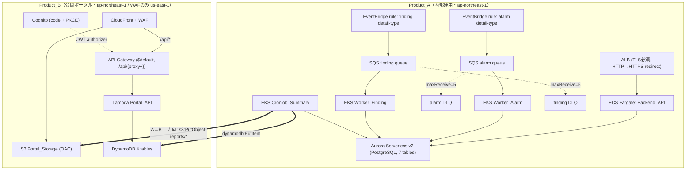
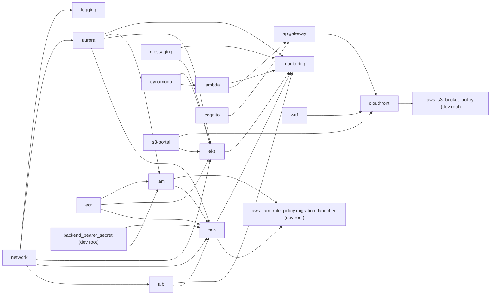
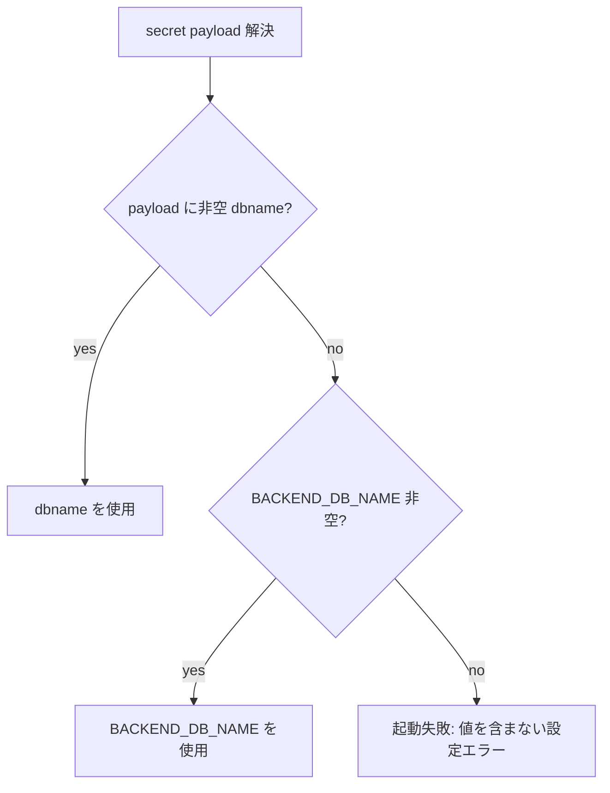
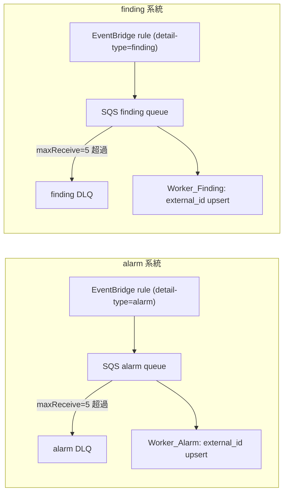
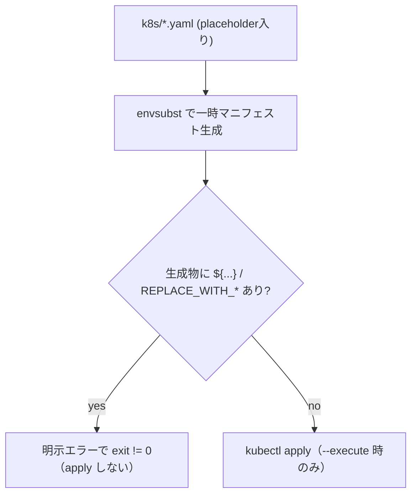
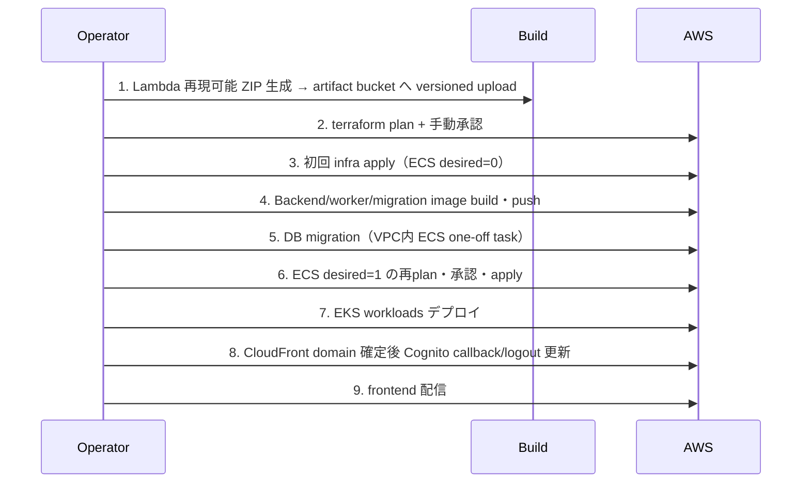

# Technical Design: dev-full-stack-wiring

## Overview

本設計は Feature「dev-full-stack-wiring」の技術設計である。目的は、現状 `network` / `ecr` / `aurora` の 3 モジュールのみ配線された dev Terraform ルート（`infra/environments/dev`）を、17 モジュール（network, ecr, aurora, alb, ecs, eks, messaging, logging, dynamodb, s3-portal, cloudfront, cognito, apigateway, lambda, monitoring, iam, waf）を配線した完全構成へ整備し、「05_阻害要因」に整理された全 34 件（P0=24 / P1=9 / P2=1）を解消することにある。

**モジュール実在状況（調査確認済み）**:
- **配線済み 3**: network / ecr / aurora（dev root に配線済み）。
- **既存だが未配線 12**: alb / ecs / eks / messaging / logging / dynamodb / s3-portal / cloudfront / cognito / apigateway / lambda / monitoring（`.tf` 実装は存在するが dev root へ未配線）。
- **新規作成が必要 2**: iam / waf（現状 `infra/modules/iam` と `infra/modules/waf` は `README.md` のみで `.tf` が未実装。本 Feature で新規作成し配線する）。

本 Feature の作業は「未配線 12 の配線 + iam / waf の新規作成と配線」で構成する。

**スコープはリポジトリ内の設計・実装（IaC / アプリ / スクリプト）・テスト・ドキュメント修正に限定**する。実 AWS 操作（`terraform apply` / AWS CLI / kubectl / docker build・push / deploy script の `--execute`）は一切行わない。完了時は「AWS 構築可能」と断定せず、「静的検証済み／実 AWS plan・apply・E2E は未実施」と明記する（Req 33.6）。

各 Acceptance Criterion は Verification_Category で分類される。
- **(A)** ローカル / CI で必須の静的・単体検証（`terraform fmt` / `validate`、参照解決、単体テスト等）。
- **(B)** mock / LocalStack 等での統合検証（EventBridge→SQS ルーティング等）。
- **(C)** Operator の明示承認後に実施する**実行環境検証**（実 AWS 操作に加えて Docker build / image inspect / kubectl / 外部デプロイ操作を含む、実行環境を要する検証）。EKS Running、CloudFront HTTP 応答、実 SQS 配送、実 DB マイグレーション完了、`docker build` による image architecture inspect、Lambda 実 invoke 等がこれに含まれる。

(C) の定義は「実 AWS だけ」ではなく「Operator 承認後に実行環境（AWS・Docker・kubectl・外部デプロイ操作）で実施する検証」に統一する。したがって Docker build / image inspect（Req 9.2）が (C) に属することは定義上整合する。

本フェーズの Definition of Done は **(A) と (B) の mock/LocalStack で成立する範囲のみ**で構成し、(C) は完了条件に含めない（Req 33.2）。

### 設計上の前提（既存コード実態）

調査で確認した既存実装の要点。設計はこれらに整合させる。

- `infra/modules/*` のうち 15 モジュールが `.tf` 実装済み（network / ecr / aurora は配線済み、alb / ecs / eks / messaging / logging / dynamodb / s3-portal / cloudfront / cognito / apigateway / lambda / monitoring は未配線）。**iam と waf は `README.md` のみで `.tf` 未実装のため本 Feature で新規作成する**。
- `infra/environments/dev/versions.tf` は `required_version >= 1.10`、`hashicorp/aws ~> 5.0`。本 Feature では Terraform を単一パッチバージョンへ固定する（後述「CI/CD・backend 設計」で決定）。`providers.tf` に `aws.us_east_1` alias は未定義（Req 17 で追加）。
- `backend.tf` は未コミット（`backend.tf.example` のみ存在）。Req 23 で partial backend をコミットする。
- `apps/backend-api/app/config.py` は `db_secret_arn` と `internal_bearer_token`（`SecretStr`）を持つが、**`BACKEND_DB_NAME` フォールバックは未実装**（Req 3.4 で追加）。`app/db/secrets.py` の `parse_database_secret` は `dbname` を必須とする厳格実装のため、RDS 管理シークレット（`dbname` 欠落）に対応するフォールバック経路が必要。
- `apps/eks-workers` は単一イメージ + 3 エントリポイント方式。ECR は Backend_API 用 + worker 3 種 + migration 用の計 **5 リポジトリ**が必要（Req 8。migration 専用リポジトリを含む。後述「DB マイグレーション実行手段」で確定）。現状 `scripts/deploy-eks.sh` は単一 `ECR_REPO` 参照で envsubst レンダリング / placeholder 検査が未実装（Req 7 で追加）。
- **既存 `infra/modules/ecr` の interface 変更が必要（確定）**: `infra/modules/ecr/variables.tf` の `repository_components` は現状 `length == 4` かつ `backend-api` / `alarm-event-processor` / `security-finding-worker` / `monthly-summary-cronjob` の 4 コンポーネントをハードコードで必須とする validation を持つ。migration 用リポジトリ（`db-migration`）を加えて 5 コンポーネント構成にするため、本 Feature でこの validation を 5 コンポーネント許容へ変更する（実装 Task で対応する既存 module interface 変更）。
- 既存 `infra/modules/eks` は 4 つの `aws_iam_role`（cluster / fargate_pod_execution / worker / cronjob）を持ち、**worker ロールは単一で `var.sqs_queue_arns`（複数 ARN list）を許可**しており Alarm/Finding 両 queue を読める状態。Req 6 の系統分離のため worker ロールを 2 分割する（後述「EKS 設計」）。既存 `infra/modules/lambda` は `aws_iam_role.portal`（Portal Lambda 実行ロール）を持つ。したがって iam module では eks / lambda が既に所有するロールを重複作成しない。
- 既存 ALB module は target group が `protocol=HTTP` / `port=var.app_port`、health check も HTTP。HTTP:80 listener は現状 forward（redirect ではない）。Backend Dockerfile は Uvicorn HTTP:8080（`EXPOSE 8080`）で **`db/migrations` を COPY していない**（migration 実行には image 構成対応が必要、後述「DB マイグレーション実行手段」）。
- `docs/operation/aws-resource-parameter-sheet.xlsx`（parameter sheet）と `docs/operation/aws-build-procedure.md`（build procedure）は**現時点で存在しない**。阻害要因 B-001〜B-034 は外部で整理された出典として参照するが、parameter sheet と build procedure は本 Feature で**新規作成する成果物**として扱う。parameter sheet には各パラメータの供給元（Req 26 の用途別供給）と、後述の**コスト要因**を記載する。
- `db/migrations/0001_init_schema.sql` に Product_A の 7 業務テーブル（incidents, incident_comments, findings, finding_triage, alarm_events, monthly_summaries, audit_logs）が定義済み。`external_id UNIQUE` と `monthly_summaries.period UNIQUE` が冪等性の基盤。
- Terraform の write-only arguments（ephemeral）は将来候補として検討する。採用時に必要な最小 Provider バージョンは断定せず、採用フェーズで公式資料により確認する（「Data Models / シークレット取り扱い」で判断）。Content was rephrased for compliance with licensing restrictions.

## Architecture

### 全体構成（Product_A / Product_B の分離と A→B 一方向連携）

Product_A（内部運用基盤）と Product_B（公開ポータル）は単一システムへ統合せず、連携は **A→B の一方向・非同期のみ**（実行主体は `Cronjob_Summary` に限定）。Product_B → Product_A への書き込み・参照は設計上排除する（Req 10.5）。



- **region**: 全リソース `ap-northeast-1`。ただし **CLOUDFRONT スコープの WAF のみ `us-east-1`**（`aws.us_east_1` aliased provider 経由）（Req 33.5, Req 17）。
- **命名**: `ops-platform-dev-<resource>`（既存 `local.name_prefix` を踏襲）。
- **配線計画の踏襲**: `docs/deployment/dev-root-wiring-plan.md` の「module output → 依存 module input」表と配線順序（Phase 1〜5）を設計の基礎とする。

### モジュール依存グラフ（配線順序）

宣言順に依存せず、module 出力参照と最小限の `depends_on` で依存グラフを確立する（Req 1.1）。



**依存グラフ変更点（現 IAM 所有設計への更新）**:
- **削除**: `iam --> eks`（EKS の IAM ロールは eks module が所有）、`dynamodb --> iam`（DynamoDB 権限は eks/lambda module 側）、`logging --> lambda`（lambda module が自身の log group `aws_cloudwatch_log_group.portal` を所有し、自前 role がその ARN への権限を持つため logging module 依存は不要）。
- **追加**: `dynamodb --> eks` と `s3-portal --> eks`（Cronjob_Summary IRSA に Portal 書込権限を付けるため）、`ecr --> iam` / `aurora --> iam`（iam module が ECR repository ARN / DB Secret ARN を policy に使うため）、`backend_bearer_secret --> iam` と `backend_bearer_secret --> ecs`（項目 3 で dev root に新設する Bearer Secret の ARN を policy 用に iam へ、secrets 注入用に ecs へ渡すため）、`iam --> ecs`、`iam --> aws_iam_role_policy.migration_launcher (dev root)` と `ecs --> aws_iam_role_policy.migration_launcher (dev root)`（migration-launcher role 本体は iam 所有、その RunTask policy は dev root で iam role name と ecs の migration cluster/task-def ARN を参照して attach するため。前述「migration-launcher-role の RunTask policy 所有場所と依存順」）。
- **維持**: `messaging --> eks`（Queue 権限）、`aurora --> eks`（DB Secret 権限）。

**iam↔ecs 循環の回避（確定）**: ecs module は自前で `aws_cloudwatch_log_group.this` を作成し `log_group_name` を output する。もし iam module がこの output（log group ARN）を入力に取ると `iam → ecs`（role output 受け渡し）と `ecs → iam`（log group ARN 受け渡し）で循環する。これを避けるため、**iam module は ecs module の output に依存せず、`data.aws_caller_identity` の account id / region / `name_prefix` と `data.aws_partition.current.partition` から対象 log group ARN を文字列組み立て（`arn:${data.aws_partition.current.partition}:logs:<region>:<account_id>:log-group:/ecs/<name_prefix>-backend-api:*` 形式。partition を `aws` 固定にしない）して policy の Resource に用いる**方式を確定採用する。これにより依存は `iam → ecs` の一方向のみとなり循環しない。migration log group ARN も同様に文字列組み立てで解決する。

配線 Phase（作業分類。既存 wiring-plan に整合）:
1. **Phase 1 基盤**（配線済み）: network → ecr → aurora
2. **Phase 2 Product_A/依存前提**: iam → alb → messaging → logging → dynamodb → s3-portal → ecs → eks
3. **Phase 3 Product_B**: cognito → lambda → apigateway
4. **Phase 4 CDN**: waf(us-east-1) → cloudfront →（dev root で bucket policy を後付け）
5. **Phase 5 監視**: monitoring（全識別子確定後）

**Phase 表の位置付け（重要な注記）**: 上記 Phase は **module 配線作業を人が進める際の作業分類**であって、Terraform が内部で resource / module を作成する順序ではない。**実際の作成順序は Terraform の dependency graph（module 出力参照と最小限の `depends_on`）が決定する**。特に EKS cluster / IRSA の完成には Aurora（DB Secret 権限）・Messaging（Queue 権限）・DynamoDB・S3 Portal（Cronjob_Summary IRSA の Portal 書込権限）の出力が必要であり、依存グラフ上 **`dynamodb` と `s3-portal` は `eks` より先行依存**である（依存グラフの `dynamodb --> eks` / `s3-portal --> eks` と一致）。この整合のため Phase 表でも dynamodb / s3-portal を eks より前に配置した。また **Two_Phase_Build（§9）は Terraform apply 後のアプリ配信（image push / migration / EKS workload 配信 / frontend 配信）の実行順序**であり、本 Phase 表（module 配線の作業分類）や Terraform dependency graph（リソース作成順）とは別レイヤーである。三者を混同しない。

## Components and Interfaces

### 1. dev root 配線（Req 1, 15, 17）

`infra/environments/dev/main.tf` に未配線 12 モジュール（alb / ecs / eks / messaging / logging / dynamodb / s3-portal / cloudfront / cognito / apigateway / lambda / monitoring）と新規 2 モジュール（iam / waf）の `module` ブロックを追加し、依存値を出力参照で受け渡す。`variables.tf` / `outputs.tf` を拡張する。

**root glue の単一所有と実装境界（確定）**: module 実装 Task は `infra/modules/*` 内の interface/resource と、それ単体で成立するアプリ・スクリプトだけを変更する。未配線 module を参照する dev root の glue resource を先行 Task に置くと、その Task 終了時点の `terraform validate` が未定義 module 参照で失敗するため、以下はすべて dev root 全配線 Task で一括実装する。

- 全 module block と module output/input の接続。
- network module の ALB/ECS/migration SG ID 配線と、ALB module 側 SG 二重作成の無効化。
- `aws_iam_role_policy.migration_launcher`（iam と ecs の両 output を参照）。
- `aws_s3_bucket_policy.portal_oac`（s3-portal と cloudfront の両 output を参照）。
- ALB access-log bucket/policy と alb module 入力の最終接続。
- `providers = { aws = aws.us_east_1 }` による WAF provider mapping。
- EKS access entry / policy association。
- dev root 所有の Backend Bearer Secret と iam/ecs への接続。

これにより、各 module Task は module 単体で検証でき、dev root は全依存が揃った統合 Task で初めて `terraform validate` する。root glue を複数 Taskで部分実装しない。

**variables.tf に追加する主な変数群**（各モジュール入力に対応。既存の validation スタイルを踏襲）:

| 変数群 | 例 | 備考 |
| --- | --- | --- |
| alb_* | `alb_acm_certificate_arn`（必須, Req19.1）, `alb_access_logs_bucket_force_destroy` | ACM ARN は placeholder 既定不可の必須入力 |
| ecs_* | `ecs_desired_count`（既定 0, Req29.1）, `ecs_task_cpu`, `ecs_task_memory`, `backend_db_name` | `backend_db_name` は Req3.4 フォールバック用 |
| eks_* | `eks_kubernetes_version`（既定 `1.36` = Standard_Support_Version、apply 直前再確認, Req20.1/20.2）, `eks_public_access_cidrs`（必須, 0.0.0.0/0 禁止 validation, Req20.5）, `eks_operator_principal_arn` | access entry 用 |
| messaging_* | `alarm_event_detail_types`, `finding_event_detail_types`, `sqs_max_receive_count`（既定 5, Req6.7） | 2 系統分離 |
| cognito_* | `cognito_callback_urls`（非空 validation, Req12.4）, `cognito_logout_urls`（非空） | code+PKCE |
| cloudfront_* | `cloudfront_price_class`（既定 PriceClass_100） | コスト配慮 |
| secret_* | `backend_bearer_secret_recovery_window_days`（Bearer Secret の recovery window, Req 4） | dev root 所有の Bearer Secret 用 |
| waf_* | `waf_log_retention_days`, `waf_additional_managed_rule_groups`（既定空）, KMS 採否変数 | Req 17 |
| その他 | `dynamodb_*`, `lambda_*`（`lambda_package_s3_bucket` / `lambda_package_s3_key` / `lambda_package_s3_object_version` / `lambda_source_code_hash` = versioned S3 object 参照。ローカル filename は渡さない。§7 / §9 参照）, `logging_*`, `monitoring_notification_*` | |

**outputs.tf の方針（外部利用値のみに限定, Req 1.4, Req 27.2）**:
- **module 間でのみ使う値は root outputs へ公開しない**。消費側 module へは `module.<producer>.<output>` を直接参照して受け渡す（root output に重複公開しない）。
- **root outputs は Deploy_Script / Infra_Pipeline / 構築手順 / Operator が外部から必要とする非機微値のみ**に限定する。具体的には:
  - `ecs`（cluster_name, service_name）… `deploy-*.sh` の run-task / service update に必要。
  - `eks`（cluster_name）… kubectl / manifest 配信に必要。
  - `messaging`（queue_urls）… worker manifest の env に必要。
  - `dynamodb`（report_metadata_table_name, public_status_items_table_name）… Cronjob manifest / frontend config に必要。
  - `cognito`（issuer_url, app_client_id, hosted_domain）… frontend config 生成に必要。
  - `cloudfront`（distribution_id, distribution_domain_name）… invalidation / Cognito callback 更新 / frontend 動作確認に必要。
  - `s3_portal`（bucket_name, reports_prefix）… frontend sync / report 書込に必要。
- **Secret 値は一切出力しない**。ワーカー等が実行時参照する Secret ARN を出力する場合は、その出力が Deploy_Script/manifest 生成に必須である旨を個別に明記した場合に限る（ARN 自体は機微でないが、必要性のない出力は追加しない）。
- Two_Phase_Build 内でのみ完結し外部消費のない識別子（例: IAM role ARN の module 間受け渡し）は root output にしない。

#### S3 / CloudFront 循環依存の解消（Req 15）

s3-portal は bucket policy の `AWS:SourceArn` に CloudFront distribution ARN を必要とし、cloudfront は s3-portal の bucket regional domain を origin に必要とする。これを **module を跨いだ resource-level 依存**に分解する:

1. `module.s3-portal` が bucket 本体（`aws_s3_bucket` + public access block + SSE + versioning）を作成。**bucket policy はモジュール内で条件付き（`cloudfront_distribution_arn` が空なら未作成）**。既存 s3-portal は `cloudfront_distribution_arn` 既定 `""` を受ける実装のため、dev root では初期はこの module を policy なしで確定させる。
2. `module.cloudfront` が s3-portal の `bucket_regional_domain_name` を S3 origin として distribution を作成。
3. **dev root 直下に `aws_s3_bucket_policy` を別リソースとして定義**し、`module.cloudfront.distribution_arn` を参照する OAC 専用ポリシー（`aws_iam_policy_document`）を bucket へ後付けで attach する。

```hcl
# dev root main.tf（概念）
module "s3_portal" {
  source                      = "../../modules/s3-portal"
  name_prefix                 = local.name_prefix
  common_tags                 = local.common_tags
  cloudfront_distribution_arn = ""   # policy はここでは付けない（循環回避）
}

module "cloudfront" {
  source                            = "../../modules/cloudfront"
  s3_origin_bucket_regional_domain  = module.s3_portal.bucket_regional_domain_name
  api_origin_domain                 = module.apigateway.api_domain_name
  web_acl_arn                       = module.waf.web_acl_arn   # us-east-1
}

# distribution ARN を参照する bucket policy を root で後付け（resource-level 依存）
data "aws_iam_policy_document" "portal_oac" { /* cloudfront.amazonaws.com + SourceArn = module.cloudfront.distribution_arn */ }
resource "aws_s3_bucket_policy" "portal_oac" {
  bucket = module.s3_portal.bucket_name
  policy = data.aws_iam_policy_document.portal_oac.json
}
```

この構造により `terraform graph` に s3-portal↔cloudfront の循環が生じない（Req 15.2）。順序は bucket 作成 → distribution 作成 → bucket policy attach（Req 15.1）。

**実装単位の分割（確定）**: この関係は 3 つの境界に分割する。(A) **Portal S3 基盤 module**（bucket 本体 + public access block + SSE + versioning + 命名、bucket name / regional domain / bucket ARN を output）、(B) **CloudFront module**（OAC / S3 origin / API origin / `/api/*` behavior / WAF `web_acl_id`）、(C) **dev root 全配線**（`aws_s3_bucket_policy.portal_oac` を distribution ARN 参照で後付け）。**EKS の Cronjob_Summary IRSA（Portal 書込権限）は Portal S3 基盤 (A) の bucket ARN のみに依存し、CloudFront module (B)・API Gateway・WAF の完了を待たない**（依存グラフ `s3-portal --> eks` は (A) 出力への依存であり、`cloudfront` は (A)+`apigateway`+`waf` に依存する別経路である）。

#### Backend 内部 Bearer Secret の所有場所（Req 4, 確定）

`BACKEND_INTERNAL_BEARER_TOKEN` の Terraform リソース（`random_password` + `aws_secretsmanager_secret` + `aws_secretsmanager_secret_version`）は **dev root 直下で作成する**（確定）。理由: Bearer Secret ARN は iam module（execution role の `secretsmanager:GetSecretValue` policy 用）と ecs module（task definition の `secrets` 注入用）の両方から参照されるため、いずれか一方の module 内に閉じ込めると他方へ受け渡す循環・重複が生じる。dev root で単一所有し、ARN を両 module の入力へ渡すことで依存を一方向（`backend_bearer_secret → iam`、`backend_bearer_secret → ecs`）に保つ。

- **生成**: `random_password`（`length >= 32`）。
- **保管**: `aws_secretsmanager_secret` + `aws_secretsmanager_secret_version` に実値を格納。実値は root output へ**一切出さない**。
- **ARN 受け渡し**: Secret ARN を iam module（policy 用）と ecs module（`secrets` 注入用）へ入力として渡す。ARN 自体は非機微だが、必要な module 入力にのみ渡す。
- **state 保護**: Secret 値は Terraform state 内に存在しうる前提で、Remote_State（S3）を暗号化・アクセス制限・versioning で保護する（Req 4.2, 27.3）。
- **lifecycle / recovery window の変数化**: `aws_secretsmanager_secret` の `recovery_window_in_days` を変数化する（`backend_bearer_secret_recovery_window_days`、既定値を設定）。lifecycle（値の再生成契機など）も変数で制御可能とする。

```hcl
# dev root main.tf（概念）
resource "random_password" "backend_bearer" { length = 32 }
resource "aws_secretsmanager_secret" "backend_bearer" {
  name                    = "${local.name_prefix}-backend-internal-bearer"
  recovery_window_in_days = var.backend_bearer_secret_recovery_window_days
}
resource "aws_secretsmanager_secret_version" "backend_bearer" {
  secret_id     = aws_secretsmanager_secret.backend_bearer.id
  secret_string = random_password.backend_bearer.result
}

module "iam" {
  source                   = "../../modules/iam"
  backend_bearer_secret_arn = aws_secretsmanager_secret.backend_bearer.arn  # execution role policy 用
  # ... db_secret_arn / ecr repository arns も入力
}

module "ecs" {
  source                   = "../../modules/ecs"
  backend_bearer_secret_arn = aws_secretsmanager_secret.backend_bearer.arn  # secrets 注入用
  # ...
}
```

#### us-east-1 provider alias（Req 17）

`providers.tf` に alias を追加し、WAF（CLOUDFRONT スコープ）へ渡す。

```hcl
provider "aws" {
  alias  = "us_east_1"
  region = "us-east-1"
  default_tags { tags = local.common_tags }
}

module "waf" {
  source    = "../../modules/waf"
  providers = { aws = aws.us_east_1 }
  scope     = "CLOUDFRONT"
}
```

### 2. IAM 設計（Req 2）

IAM ロールは**所有 module を明確化**し、既存 module（eks / lambda）が既に作成しているロールを iam module で重複作成しない。

**新規 `iam` モジュールが所有するロール**は Product_A の ECS 系 **5 ロール**（Backend ECS task execution role / Backend ECS task role / migration execution role / migration task role / migration-launcher role）とし、dev root から ecs モジュールへ出力（Backend / migration の execution・task role）を渡す（Req 2.1, 2.2, 2.9）。ただし **migration-launcher role については iam module が作成するのは role 本体と trust policy のみ**であり、その `ecs:RunTask` / `ecs:DescribeTasks` / `iam:PassRole` を含む起動用 inline policy は ecs module 出力（migration cluster ARN / migration task definition ARN）を要するため **dev root 直下で attach する**（後述「migration-launcher-role の RunTask policy 所有場所」）。EKS の IRSA ロールは既存 eks モジュール（後述「EKS 設計」で worker を 2 分割）が、Portal Lambda 実行ロールは既存 lambda モジュール（`aws_iam_role.portal`）が所有する。

**決定的role名（bootstrapとiam moduleの共有契約）**:

| 用途 | role name |
| --- | --- |
| Backend execution | `${name_prefix}-ecs-task-execution-role` |
| Backend task | `${name_prefix}-ecs-task-role` |
| migration execution | `${name_prefix}-migration-execution-role` |
| migration task | `${name_prefix}-migration-task-role` |
| migration launcher | `${name_prefix}-migration-launcher-role` |

最初の4 role nameはbootstrapのPassRole ARN組み立てとiam moduleのresource nameで完全一致させる。launcherはPassRole対象ではない。

iam module が policy に用いる ECR repository ARN / DB Secret ARN は dev root から ecr / aurora module 出力として渡し、Bearer Secret ARN は dev root で新設する Bearer Secret（後述「§4 Backend 内部 Bearer トークン」「§1 dev root 配線」）から渡す。**対象 CloudWatch Logs（Backend / migration）の log group ARN は ecs module 出力に依存せず、`data.aws_partition.current.partition` / account id / region / `name_prefix` から文字列組み立てして解決する（partition を `aws` 固定にしない）**（前述「iam↔ecs 循環の回避」）。

| ロール | 所有 module | 責務 | 主要権限（Resource_Level_Action は個別 ARN 限定） |
| --- | --- | --- | --- |
| `ecs-task-execution-role`（Backend 用） | **iam（新規）** | ECR pull, CloudWatch Logs 作成/書込, task definition の `secrets` 注入時の secret 取得 | `logs:CreateLogStream`/`PutLogEvents`（文字列組み立てした Backend log group ARN）, `ecr:GetDownloadUrlForLayer` 等, **`secretsmanager:GetSecretValue`（Bearer secret ARN のみ）**（Req 4.3 の `secrets` 注入用） |
| `ecs-task-role`（Backend_API） | **iam（新規）** | 実行時にアプリ自身が Secrets Manager から DB secret を取得, Aurora 接続 | `secretsmanager:GetSecretValue` を **`BACKEND_DB_SECRET_ARN` が指す DB secret ARN のみ**に限定（Req 2.3, 3.3）。**Bearer secret 取得権限は付与しない**（Bearer は execution role が注入するため） |
| `migration-execution-role`（migration 専用 execution role） | **iam（新規）** | migration image の ECR pull, `awslogs` driver の CloudWatch Logs 出力, 起動時 Secret 取得（該当時） | `ecr:GetDownloadUrlForLayer`/`ecr:BatchGetImage`/`ecr:GetAuthorizationToken` 等, `logs:CreateLogStream`/`PutLogEvents`（文字列組み立てした migration log group ARN）。**Backend 用 execution role と共有せず専用**（権限対象を migration リソースへ限定） |
| `migration-role`（migration task role） | **iam（新規）** | 一回限りマイグレーションタスクの runner が実行時に DB secret を取得 | `secretsmanager:GetSecretValue`（DB secret ARN のみ）**のみ**。**awslogs（CloudWatch Logs）権限は付与しない**（execution role 側） |
| `migration-launcher-role`（migration 起動主体, 確定） | **iam（新規, role 本体 + trust policy のみ）** | Operator が AssumeRole し、初回 infra 後に migration one-off task を単発起動する唯一の起動主体 | iam module は **role 本体と trust policy のみ**を作成し、role name / ARN を output する。**`ecs:RunTask` / `ecs:DescribeTasks` / `iam:PassRole` を含む起動用 policy は iam module では付与せず、dev root 直下の `aws_iam_role_policy.migration_launcher` で attach する**（後述「migration-launcher-role の RunTask policy 所有場所」）。理由: RunTask policy は ecs module 出力（migration cluster ARN / migration task definition ARN）を必要とし、iam module 入力にすると iam↔ecs 循環になるため。 |
| `eks-alarm-worker-role`（IRSA） | eks（既存を分割） | Alarm SQS 受信/削除, DB secret 取得, Logs | `sqs:ReceiveMessage`/`DeleteMessage`/`GetQueueAttributes`/`GetQueueUrl`（**alarm queue ARN のみ**）, `secretsmanager:GetSecretValue`（DB secret ARN のみ）, Logs |
| `eks-finding-worker-role`（IRSA） | eks（既存を分割） | Finding SQS 受信/削除, DB secret 取得, Logs | 同上（**finding queue ARN のみ**）, `secretsmanager:GetSecretValue`（DB secret ARN のみ）, Logs |
| `eks-cronjob-role`（IRSA, A→B 唯一の実行主体） | eks（既存） | Aurora 読取, Portal 書込, Logs | `secretsmanager:GetSecretValue`（DB secret ARN のみ）, `s3:PutObject` を Portal_Storage の `reports/*` のみ, `dynamodb:PutItem` を report_metadata / public_status_items の 2 テーブルのみ（Req 10.2）。他 prefix / table への read/write なし |
| `lambda-portal-role` | lambda（既存） | DynamoDB 読取 + page_view_logs 書込, Logs | 各 table ARN に限定。Product_A への書込・参照なし |

（`bootstrap` の CodeBuild / CodePipeline / terraform 実行ロールは本 Feature のスコープ外の既存資産で、iam module では作らない。ただし PassRole については後述の通り bootstrap 側 policy の修正が必要。）

**Wildcard_Exception の扱い（Req 2.5, 2.6）**: AWS がリソースレベル権限をサポートしない Action（例: 一部の `Describe*`/`List*`、`logs:CreateLogGroup`）のみ `Resource = "*"` を許容し、`aws:RequestedRegion`（`ap-northeast-1` / WAF は `us-east-1`）や `aws:ResourceTag` 等の Condition で制約する。許容エントリは **Wildcard_Exception_Registry** に記録する。

- **Registry の記録場所**: `infra/modules/iam/wildcard-exceptions.md`（およびテストが読む機械可読版 `infra/modules/iam/wildcard_exceptions.json`）。
- **各エントリのフォーマット**: `{ "action": "logs:CreateLogGroup", "reason": "resource-level ARN not supported before group exists", "conditions": {"aws:RequestedRegion": "ap-northeast-1"} }`。

**PassRole の限定と付与先（Req 2.6, 2.8, 確定）**: `iam:PassRole` を必要とするのはアプリ実行ロールではなく、**タスク定義を登録・起動する実行主体**である。付与先を以下に具体化する:

- **task definition 登録時（`aws ecs register-task-definition` / Terraform）**: **bootstrap の terraform-exec-role** が、各 task definition の execution role / task role へ PassRole を行う。
- **migration の `aws ecs run-task` 実行時**: **Operator が AssumeRole する `migration-launcher-role`（iam module 所有, 単一確定）** が、migration task definition の migration execution role と migration task role へ PassRole を行う（「CodeBuild または Operator」という選択肢は解消し、起動主体は migration-launcher-role の AssumeRole に単一化する）。

PassRole の allowlist（各 task definition が pass しうる role ARN の全体集合）は、以下の **4 ARN** のみに限定する:
- Backend ECS task execution role
- Backend ECS task role
- migration execution role
- migration task role

このうち **migration-launcher-role 自身が PassRole できる対象は migration execution role と migration task role の 2 つのみ**であり、Backend の execution/task role へは pass しない。migration-launcher-role は pass する側であって pass 対象ではない。いずれの PassRole statement も `iam:PassedToService = ecs-tasks.amazonaws.com` の Condition で ECS へ pass する用途に限定する。allowlist は iam module 内で明示列挙し、静的テストで逸脱を検出する。

**bootstrap 側 IAM policy の修正が必要（確定, 実装 Task）**: bootstrap の `terraform-exec-role` は、本 Feature で新規作成する上記 4 role ARN（Backend execution / Backend task / migration execution / migration task）への `iam:PassRole`（`PassedToService = ecs-tasks.amazonaws.com` 制約付き）を許可する必要がある。これは bootstrap 側の既存 IAM policy 修正として実装 Task に含める。migration の `run-task` 起動は migration-launcher-role が担うため、CodeBuild role に migration 起動用 PassRole は付与しない。

**bootstrap から dev state を参照しない ARN 解決（確定）**: bootstrap は Dev_Root より先に構築される独立 Terraform root であるため、Dev_Root の remote state、module output、data source 経由の実在 role lookupには依存しない。4つの PassRole ARN は `data.aws_partition.current.partition`、`data.aws_caller_identity.current.account_id`、両 root で共有する `name_prefix`、および iam module が採用する4つの決定的 role nameから `bootstrap/iam.tf` 内で組み立てる。静的 contract test は bootstrap 側の4 role nameと `infra/modules/iam` が作成する4 role nameの完全一致、allowlistが4 ARNだけであること、dev state参照が存在しないことを検証する。

**migration-launcher-role の運用（確定, Req 5 / Req 30）**: migration を起動する `deploy-*.sh` は既定 dry-run（print-only）とし、`--execute` が明示された場合にのみ migration-launcher-role を AssumeRole してから `aws ecs run-task` を実行する（Req 30.1）。AssumeRole して migration-launcher-role を利用する principal ARN（Operator の IAM principal）は **Parameter Sheet の必須入力**として供給し、実 ARN はリポジトリに記載しない（placeholder）。

**migration-launcher-role の RunTask policy 所有場所と依存順（確定, iam↔ecs 循環回避）**: migration-launcher-role の起動用 policy は ecs module が作成する migration cluster ARN と migration task definition ARN を必要とする。これらを iam module 入力に取ると `iam → ecs`（role output 受け渡し）と `ecs → iam`（cluster / task-def ARN 受け渡し）で循環するため、以下の構成へ確定する:

- **iam module**: migration-launcher-role の **role 本体と trust policy のみ**を作成し、`migration_launcher_role_name` / `migration_launcher_role_arn` を output する（RunTask policy は付けない）。
- **ecs module**: migration の **cluster ARN と migration task definition ARN を output する**（`migration_cluster_arn` / `migration_task_definition_arn`）。
- **dev root 直下**: `aws_iam_role_policy.migration_launcher` を作成し、`role = module.iam.migration_launcher_role_name`、policy document は `module.ecs.migration_task_definition_arn` / `module.ecs.migration_cluster_arn` を参照する。
- policy 内容:
  - `ecs:RunTask` は **migration task definition ARN のみ**を Resource とする。
  - cluster 制限は `ecs:RunTask` statement に `Condition { StringEquals { "ecs:cluster" = module.ecs.migration_cluster_arn } }` を付し、migration 対象 cluster のみに限定する。
  - `ecs:DescribeTasks` は AWS が要求する resource scope に従う。resource-level scoping が可能ならその ARN に限定し、AWS が `Resource = "*"` を要求する場合のみ Wildcard_Exception_Registry へ理由付き（`aws:RequestedRegion = ap-northeast-1` 等の Condition 付き）で登録する。
  - `iam:PassRole` は **migration execution role と migration task role の 2 ARN のみ**を対象とし、`iam:PassedToService = ecs-tasks.amazonaws.com` の Condition を付す。Backend の execution/task role へは pass しない。
- **依存順（確定）**: `iam → ecs → root の migration-launcher policy`（root policy が iam と ecs の両 output を参照する）。この構成により **iam module と ecs module の間に循環は生じない**（role 本体は iam、RunTask policy は root で ecs 出力を参照）。

**静的 IAM ポリシーテストの検証ロジック（Req 2.8）**: 各ロールの `aws_iam_policy_document`（またはレンダリング JSON）を解析し、以下で fail:
1. Resource_Level_Action の statement に `Resource = "*"` がある。
2. `*` を使う Action が Wildcard_Exception_Registry に未登録。
3. `PassRole` の対象が許可リスト（Backend ECS task execution role / Backend ECS task role / migration execution role / migration task role の 4 ARN）外の ARN を含む、`iam:PassedToService = ecs-tasks.amazonaws.com` の Condition を欠く、または migration-launcher-role の `PassRole` が migration execution role / migration task role 以外を対象に含む。
4. secret / table / queue 権限が必要集合外の ARN を含む（例: Backend task role が Bearer secret ARN を持つ、migration task role が CloudWatch Logs 権限を持つ、alarm worker role が finding queue ARN を持つ 等）。

### 3. Backend DB シークレット注入と dbname フォールバック（Req 3）

**注入（Req 3.1〜3.3）**: `ecs` モジュールは Aurora シークレット ARN を **単一環境変数 `BACKEND_DB_SECRET_ARN`** として task definition の通常の `environment`（plaintext env）に **ARN 文字列のみ**設定する（ARN は機微ではない）。アプリ（Backend_API）が**実行時に自分で Secrets Manager から DB secret を取得**するため、`secretsmanager:GetSecretValue`（当該 DB secret ARN のみ）は **ECS task role** に付与する（execution role ではない）。シークレット平文はいかなる環境変数・出力・ログ・リポジトリファイルにも出さない。

**責務分担の要点（Req 3 / Req 4）**:
- `BACKEND_DB_SECRET_ARN`（DB secret）: plaintext env に ARN → アプリが実行時取得 → 取得権限は **ECS task role**。
- `BACKEND_INTERNAL_BEARER_TOKEN`（Bearer）: task definition の `secrets`（Secrets Manager 参照）で値注入 → 取得は ECS agent が起動時に実施 → 取得権限は **ECS task execution role**。
- **Backend ECS task role に Bearer secret の取得権限は付与しない**（アプリは Bearer を Secrets Manager から自分で取らず、注入済み env として受け取るため）。

**dbname フォールバック（Req 3.4〜3.6）**: 既存 `apps/backend-api/app/config.py` / `app/db/secrets.py` を以下のように拡張する。

- `Settings` に `db_name: str | None`（`BACKEND_DB_NAME`）を追加。
- `app/db/secrets.py` に RDS 管理シークレット形（`username`/`password`/`host`/`port` を含み `dbname` を欠く）を許容する解決経路を追加する。設計方針:
  - `parse_database_secret` は現行の厳格版を維持しつつ、`dbname` を optional として解析する版（またはパラメータ）を用意し、`dbname` 欠落時は呼び出し側（`session.py` / 新規 resolver）が `settings.db_name` を採用する。
  - `dbname` も `BACKEND_DB_NAME` も両方欠落/空なら **起動失敗**し、シークレットのフィールド値を含まない設定エラーを送出する（Req 3.5）。既存 `DatabaseConfigurationError` は値を埋めない実装のため踏襲。
- **自動テスト（Req 3.6）**: RDS 管理形ペイロード（`dbname` 省略）を与え、解決された DB 名が `BACKEND_DB_NAME` の値に一致することを assert する単体テスト。



### 4. Backend 内部 Bearer トークン（Req 4）

- **所有場所（確定）**: `random_password` / `aws_secretsmanager_secret` / `aws_secretsmanager_secret_version` は **dev root 直下**で定義し（前述「§1 Backend 内部 Bearer Secret の所有場所」）、Secret ARN を iam module（policy 用）と ecs module（`secrets` 注入用）へ渡す。module 内には閉じ込めない。
- **生成**: Terraform の `random_password`（`length >= 32`）で生成（Req 4.1）。
- **保管**: 実値の唯一の保管先を Secrets Manager とする（`aws_secretsmanager_secret` + version）。出力・ログ・plaintext env・リポジトリに出さない。`recovery_window_in_days` と lifecycle は変数化する。
- **注入**: `ecs` モジュールは task definition の `secrets`（Secrets Manager 参照）として Backend_API に注入する（plaintext env にしない, Req 4.3）。この注入は **ECS task execution role の `secretsmanager:GetSecretValue`（Bearer secret ARN のみ）**で ECS agent が起動時に解決する。**Backend ECS task role には Bearer secret の取得権限を付与しない**（アプリは注入済み env を読むだけで自分では Secrets Manager から取得しない）。
- **認証動作（Req 4.4, 4.5）**: 保護ルートは `Authorization: Bearer <token>` が注入トークンと完全一致すれば 401/403 を返さず対象エンドポイントの成功ステータスを返す。ヘッダ欠落・非 Bearer スキーム・不一致は **HTTP 401 + `WWW-Authenticate: Bearer`** を返す。既存 `internal_bearer_token: SecretStr` を用いた依存性で FastAPI の認証依存関数を実装する。

### 5. メッセージング設計（Req 6）

`messaging` モジュールで **alarm 系統と finding 系統をそれぞれ独立**に定義する（Req 6.1）:

- 系統ごとに `aws_cloudwatch_event_rule`（detail-type で限定した event pattern）+ `aws_sqs_queue`（Standard）+ 専用 DLQ（`redrive_policy` の `maxReceiveCount = 5`, Req 6.7）。
- EventBridge target により **alarm イベントは alarm queue のみ**、**finding イベントは finding queue のみ**に配送し、相互に混在させない（Req 6.3, 6.4。実配送は (B) mock/LocalStack / (C) 実 AWS）。

**冪等制御（Req 6.5, effectively-once）**: SQS Standard の at-least-once を前提とし、重複配送を許容する。worker は `external_id` をキーとした冪等 upsert（DB の `UNIQUE(external_id)` + `INSERT ... ON CONFLICT DO NOTHING/UPDATE`）で業務データへの重複反映を防ぐ。既存 `db/migrations/0001_init_schema.sql` の `alarm_events.external_id UNIQUE` / `findings.external_id UNIQUE` がこれを支える。`apps/eks-workers` は成功後にのみ SQS メッセージを削除し、失敗は再配送される。



### 6. EKS 設計（Req 7, 8, 20）

**ワークロード別イメージ（Req 8）**: `ecr` モジュールは **5 リポジトリ（Backend_API + worker 3 種 + migration 1）**を維持する（Req 8.1）。EKS の 3 manifest（Worker_Alarm / Worker_Finding / Cronjob_Summary）はそれぞれ別リポジトリ・別 image を参照し、2 ワークロードが同一リポジトリを参照しない（Req 8.3）。migration runner は Backend_API / worker とは別の専用リポジトリ（`db-migration`）を参照する。`scripts/deploy-eks.sh` は存在しない単一 `eks-workers` リポジトリではなく 3 リポジトリを参照するよう修正する（Req 8.2）。

**ecr module の validation 変更（確定, 既存 interface 変更）**: `infra/modules/ecr/variables.tf` の `repository_components` は現状 `length == 4` の固定 validation のため、migration リポジトリを加えた 5 コンポーネント（`backend-api` / `alarm-event-processor` / `security-finding-worker` / `monthly-summary-cronjob` / `db-migration`）を許容するよう validation を変更する。

**マニフェストレンダリングと Placeholder 検査（Req 7）**: `deploy-eks.sh` を、`k8s/*.yaml` を `envsubst` で一時生成マニフェストへ変数展開してから apply する方式へ拡張する（Req 7.1）。生成後に `${...}` と `REPLACE_WITH_*` を走査し（Req 7.2）、残存すれば明示エラーで異常終了する（Req 7.3）。



**EKS version / access / 公開範囲（Req 20）**:
- `eks` モジュールの Kubernetes version 既定を **`1.36`** にする（Req 20.1）。ビルド手順に以下を明記する（Req 20.2）:
  - apply 直前に AWS 公式ドキュメントで Standard Support 対象を再確認する。
  - 既定値（1.36）が再確認時点で Standard Support 外なら plan / apply を停止して更新する。
  - **extended support を前提にしない**。
  - 選定した Kubernetes version と **Fargate / add-on（CoreDNS 等）の compatibility** を確認する。
  - （注: 2026-09 時点で 1.31 / 1.32 / 1.33 は Standard Support 対象ではないため、旧記述の「1.31 以上」は用いない。具体版数はハードコードせず既定 1.36 + apply 直前再確認で運用する。）
- dev root に kubectl 実行 principal 向けの `aws_eks_access_entry` + access policy association を作成（Req 20.3）。
- `eks_public_access_cidrs` を必須入力とし、`0.0.0.0/0` を禁止する validation を設ける（Req 20.5）。

**Worker IRSA ロールの 2 分割（Req 6.5, 2.4）**: 既存 eks module は単一 `worker` ロールに `var.sqs_queue_arns`（複数 ARN list）を許可しており、Alarm/Finding worker が互いの queue を読める。これを最小権限のため **2 ロールへ分離**する。あわせて cronjob ロールを含む 3 IRSA を ServiceAccount 単位で整理する。

- **eks module の interface 変更**: 単一入力 `var.sqs_queue_arns`（list）を廃止し、`var.alarm_queue_arn`（単一 ARN）と `var.finding_queue_arn`（単一 ARN）へ分割する。各ロールは自系統の queue ARN のみを許可する。
- **各 worker ロールに DB secret 取得を付与**: alarm/finding worker はいずれも Aurora へ書き込むため、`secretsmanager:GetSecretValue`（DB secret ARN のみ）を各ロールに付与する（cronjob も同様。既存 worker/cronjob は既に db_secret 取得を持つが、分割後も各ロールへ引き継ぐ）。

**ServiceAccount / queue URL / DB Secret ARN 対応表**:

| ワークロード | Kubernetes ServiceAccount | IRSA role | 参照 queue（env: queue URL） | SQS 権限対象 ARN | DB secret 取得 |
| --- | --- | --- | --- | --- | --- |
| Worker_Alarm | `alarm-worker-sa` | `eks-alarm-worker-role` | alarm queue URL | alarm queue ARN のみ | DB secret ARN のみ |
| Worker_Finding | `finding-worker-sa` | `eks-finding-worker-role` | finding queue URL | finding queue ARN のみ | DB secret ARN のみ |
| Cronjob_Summary | `cronjob-summary-sa` | `eks-cronjob-role` | （SQS 参照なし） | なし | DB secret ARN のみ（+ Portal S3/DynamoDB 書込, Req 10.2） |

各 ServiceAccount は対応する IRSA role ARN で annotate し、manifest の env（queue URL 等）は dev root outputs / deploy script のレンダリングで注入する。

**Fargate Pod ログ収集（可観測性設計・既存実態整合・確定）**: EKS Fargate では CloudWatch Log Group + IAM 権限だけでは Pod の stdout/stderr は自動転送されない。**Fargate 組み込みログルーター（AWS for Fluent Bit ベース）を採用する（確定）**。既存 `infra/modules/eks` は本方式を既に実装しており（`aws-observability` namespace の Fargate profile、`fargate_pod_execution` role への logging inline policy、`aws_cloudwatch_log_group.workers`）、設計はこれに整合させる。DaemonSet 方式の Fluent Bit は用いない。

- **`aws-observability` namespace**: Fargate profile `aws-observability`（既存 `aws_eks_fargate_profile.aws_observability`）で選択する。
- **`aws-logging` ConfigMap**: `aws-observability` namespace に AWS for Fluent Bit 用 ConfigMap（`aws-logging`、`output=cloudwatch_logs`）を k8s manifest として適用する。
- **出力先 log group**: 既存 `aws_cloudwatch_log_group.workers`（`/${name_prefix}/eks/workers`）。
- **retention**: 既存 `var.log_retention_days`（変数化済み。Parameter Sheet のコスト要因に記載）。
- **必要権限**: 既存 `aws_iam_role_policy.fargate_logging`（`fargate_pod_execution` role の logging 権限）。ログストリーム名は router が実行時生成するため `Resource = "*"` を用いており、これは Wildcard_Exception として扱う（`aws:RequestedRegion` 等の Condition と Registry 記録の対象）。
- **manifest 適用順**: namespace / ConfigMap（`aws-observability` → `aws-logging`）を worker ワークロードより先に適用する。build procedure / deploy script の適用順に明記する。

### 7. Product_B 設計（Req 9-14, 16-19）

**Docker アーキテクチャ（Req 9）**: image を build する Deploy_Script は全 `docker build` で `--platform linux/amd64` を指定し、ECS の X86_64 ランタイムに一致させる（Req 9.1、スクリプト静的チェックは (A)）。実 `docker build` による image architecture inspect は **(C)（Operator 承認後の実行環境検証。Docker 実行を要するため）**。

**A→B 連携の冪等（Req 10）**: `Cronjob_Summary` manifest に 3 つの Portal 連携環境値（reports bucket / report_metadata table / public_status_items table）を定義（Req 10.1）。対象期間から**決定的な S3 オブジェクトキー**（例: `reports/<YYYYMM>.json`）と**決定的な DynamoDB item キー**を導出し、upsert（`PutItem`）で書き込む（Req 10.3）。リトライ時は同一キーへの upsert で「S3 に 1 オブジェクト、各テーブルに 1 item」へ収束し重複を作らない（Req 10.4）。いずれかの書込失敗時は run を失敗として報告する（Req 10.6）。

**Lambda 再現可能パッケージ（Req 11, S3 versioned object 参照へ確定）**: 再現可能ビルド手順で決定的 zip を生成し、`lambda` モジュールへは **ローカル filename ではなく versioned S3 object 参照**（`package_s3_bucket` / `package_s3_key` / `package_s3_object_version` / `source_code_hash`）を渡す（Req 11.1, 11.2）。ローカル絶対パス（旧 `"${path.root}/../../../apps/portal-lambda/dist/portal-api.zip"`）は **plan を実行した CodeBuild コンテナの絶対パスとして tfstate/plan に保存されうるため、別コンテナで実行する apply stage で不整合を起こす**。これを避けるため次を確定する:

- **生成と配置**: Build stage で決定的 zip（固定 mtime / ソート順 / 固定 permission）を生成し、**bootstrap の暗号化済み artifact bucket** へ **commit SHA を含む不変キー**（例: `lambda/<commit-sha>/portal-api.zip`）でアップロードする。bucket は **versioning を有効化**し、アップロード後に返る **object version** を取得する。
- **Terraform への受け渡し**: lambda module へ `lambda_package_s3_bucket`（artifact bucket 名）/ `lambda_package_s3_key`（`lambda/<commit-sha>/portal-api.zip`）/ `lambda_package_s3_object_version`（取得した version id）/ `lambda_source_code_hash`（決定的 zip の `filebase64sha256` 相当）を渡す。
- **plan / apply の一貫性**: **plan 前に S3 object を配置**し、apply は同一 bucket / key / version / hash を含む **承認済み binary plan のみ**を適用する（Req 25.3 と整合）。apply stage は **ローカル ZIP path に一切依存しない**（S3 object 参照のみ）。
- **保護**: artifact object は **SSE-KMS 暗号化・アクセス制限（pipeline role のみ）・lifecycle expiration** を適用する。Lambda package の S3 bucket と Lambda function は **同一 region（`ap-northeast-1`）**とする。
- **既存 lambda module の interface 変更（事実確認済み・実装 Task）**: 既存 `infra/modules/lambda` は `package_s3_bucket` / `package_s3_key` 変数は持つが、**`package_s3_object_version` と `source_code_hash` の入力変数を持たない**。本 Feature の実装 Task で **これら 2 入力変数を lambda module へ追加**し、`aws_lambda_function` の `s3_object_version` / `source_code_hash` へ配線する。
- **package upload は Category C**: artifact bucket への実 zip アップロードは実行環境操作のため **Verification: C（Operator 承認後）**とし、本フェーズでは実行しない。**同一ソースから 2 回生成して zip hash が一致することの確認（Req 11.3）はローカルで完結する Verification: A** である。
- invoke smoke check は build procedure に記載（Verification: C）。

**Cognito（Req 12）**: `cognito` モジュールで User Pool domain、app client の callback URL（1 以上）/ logout URL（1 以上）、許可 OAuth flows / scopes を設定（Req 12.1）。**app client は `generate_secret = false` の public client** とし、**authorization code grant + PKCE を有効化、implicit grant は無効**（Req 12.2）。PKCE の `code_verifier` / `code_challenge` / `state` の生成・保持・検証は Frontend の責務とする（後述「Frontend 認証フロー」）。issuer URL と app client id を非空文字列 output として apigateway JWT authorizer へ渡す（Req 12.3）。callback/logout が空なら plan/apply で validation エラー（Req 12.4）。

**Cognito と CloudFront の初回構築依存の解決（設計判断, Req 12.4 / Req 29.3）**: 初回 apply 時点では CloudFront distribution domain が未確定だが、Cognito の callback/logout URL は非空必須である。この鶏卵問題を **`REPLACE_WITH_*` 等の placeholder URL を使わず** 解決するため、次を採用する:

- **初回 apply では、固定した開発用 callback/logout URL で Cognito を作成**する（非空・検証可能な実 URL であり placeholder ではない）。曖昧な例示は排除し、以下で確定する:
  - **callback URL**: `http://localhost:5173/callback`
  - **logout URL**: `http://localhost:5173/`
  - ローカル証明書を用意しないため、Cognito が localhost に限り許容する HTTP URL を用いる（localhost 以外の HTTP は不可のため CloudFront 確定後は HTTPS を使う）。
- CloudFront distribution 確定後、`cognito_callback_urls` / `cognito_logout_urls` を確定ドメイン（HTTPS）へ**置換して再 plan → 承認 → apply** する（Two_Phase_Build の該当ステップ）。
- **確定後の既定は localhost URL を残さず CloudFront URL へ置換する**。開発用 localhost URL を残す場合は、明示変数（例: `cognito_keep_localhost_urls`、既定 false）で Operator が選択する。

**Frontend 認証フロー（Req 13）**: OAuth callback で code+PKCE を完了し、認可要求時に送出した `state` と返却 `state` の一致を検証（不一致はトークン保存せずエラー表示, Req 13.1, 13.2）。**トークン保存方式の決定**: XSS リスク・expiry・logout 削除の要件から、**アクセストークンはメモリ内（JS 変数）保持、`state` / PKCE verifier などの短命フローデータのみ `sessionStorage`** を用いる方式を採用する。根拠: `localStorage` は XSS で永続的に盗まれるため回避、`sessionStorage`+メモリはタブクローズで消え永続化を避けられる。expiry は `expires_in` に基づきメモリ側で失効管理し、logout 時はメモリと sessionStorage の該当キーを削除して Cognito logout URL へリダイレクト（Req 13.4）。`deploy-frontend.sh` は Terraform 出力から一時 `config.js` を生成し、成果物の placeholder を走査、残存すれば非公開で異常終了（Req 13.5, 13.6）。4 API 応答の実確認は (C)。

**API Gateway / CloudFront パス整合（Req 14）**: `apigateway` は `$default` stage + route `/api/{proxy+}`（Req 14.1）。`cloudfront` は 2 つの behavior を持つ（Req 14.2）:

- **default behavior**: S3 (Portal_Storage) origin（OAC）。静的サイト配信。
- **`/api/*` behavior（API Gateway origin へ転送、パス保持）**:
  - origin: API Gateway `$default` stage の domain。**path pattern `/api/*` をパス保持のまま**転送（rewrite しない）。
  - caching: **無効**（cache policy = AWS managed `CachingDisabled`）。
  - origin request policy: **AWS managed `AllViewerExceptHostHeader`** を採用。理由: `Authorization` ヘッダ・query string・API に必要な cookie を転送しつつ、**API Gateway へ不適切な `Host` ヘッダを転送しない**（CloudFront が origin domain の Host を付与）。
  - 許可 HTTP メソッド: `GET, HEAD, OPTIONS, PUT, POST, PATCH, DELETE`（API が必要とするフルセット）。
  - viewer protocol policy: **`redirect-to-https`**（HTTPS 強制）。
  - default behavior（S3）と API behavior を明確に分離し、`/api/*` のみ API origin、それ以外は S3 origin。

JWT authorizer による 200/401 判定ロジックは (A)/(B)、実 HTTP 200/401 は (C)。

**バケット命名の一意化（Req 16）**: Portal_Storage / ALB access-logs の bucket 名に AWS account id と region を suffix として含め（Req 16.1, 16.2）、63 文字以内にする（Req 16.3）。命名式は `local` で組み立て、`data.aws_caller_identity` / `var.aws_region` を用いる。

**ALB アクセスログ（Req 18）**: dev root に ALB access-logs S3 bucket + ALB log-delivery bucket policy を作成（Req 18.1）、alb モジュールで access logging を当該 bucket へ有効化（Req 18.2）。

**ALB TLS 終端境界（Req 19、既存アプリ実態に整合）**: Backend は Uvicorn HTTP:8080 で動作し、target group / health check も HTTP である。バックエンドを HTTPS 化せず、**ALB で TLS 終端し内部は HTTP:8080** とする方式を採用する（内部 target を HTTPS 化しないことは既存実装と整合し、証明書運用を単純化する）。

- Client → ALB: **HTTPS**（HTTPS:443 listener, ACM 証明書必須, Req 19.1）。
- ALB HTTP:80 listener → **HTTPS へ 301/302 redirect**（現状の forward を redirect アクションへ変更, Req 19.2）。
- ALB → ECS private target: **HTTP:8080**（target group protocol=HTTP のまま。ALB でのみ TLS 終端）。
- ALB SG から ECS SG への **8080 のみ許可**（Req 19.3 の「暗号化済みトラフィックのみをバックエンドへ渡す」を「TLS 終端は ALB、内部は private subnet 内 HTTP:8080」として満たす）。

```mermaid
flowchart LR
  V["Viewer"] -->|HTTPS:443| L443["ALB HTTPS listener (ACM cert)"]
  V -->|HTTP:80| L80["ALB HTTP listener"]
  L80 -->|301/302 redirect| L443
  L443 -->|HTTP:8080 (private)| ECS["ECS Fargate Backend_API (Uvicorn 8080)"]
```

**ACM 証明書と DNS 前提（Req 19.1, Parameter Sheet / build procedure の必須事前入力）**: ALB 標準 DNS 名（`*.elb.amazonaws.com`）だけでは所有 ACM 証明書のホスト名と一致しないため、以下を **新規作成する parameter sheet と build procedure の必須事前入力**として定義し、決定を保留にしない:

| 事前入力 | 内容 |
| --- | --- |
| Backend 用 FQDN | 例 `api.dev.<example-domain>`（placeholder。実ドメインは記載しない） |
| ACM 証明書 ARN | ap-northeast-1 で発行済みの証明書 ARN（`alb_acm_certificate_arn` 必須入力, placeholder 既定不可） |
| DNS 検証方法 | ACM DNS 検証（検証用 CNAME を DNS ゾーンへ登録） |
| ALB への DNS 設定 | 上記 FQDN を ALB へ指す alias（Route 53）または CNAME |

**Route 53 の扱い（設計判断）**: 本 Feature では **Route 53 を Terraform 管理対象とせず、DNS ゾーン・レコード・ACM 検証 CNAME・ALB alias/CNAME は外部前提（Operator が事前に用意・登録）**とする。理由: dev の DNS ゾーンは環境横断の共有資産で本 Feature のスコープ（module 配線整備）外であり、証明書 ARN と FQDN を必須入力として受け取る方式で十分要件を満たせるため。build procedure に「FQDN 決定 → ACM 発行・DNS 検証 → 証明書 ARN を入力 → apply 後に ALB へ DNS を向ける」順序を明記する。

### 7b. WAF モジュール（新規, Req 17）

`infra/modules/waf` は現状 `README.md` のみのため、本 Feature で `.tf` を新規作成する。CloudFront に関連付ける Web ACL を提供する。

- **作成リソース**: `aws_wafv2_web_acl`（CloudFront 用）と、WAF logging 用 `aws_wafv2_web_acl_logging_configuration`（**既定で作成**する。`waf_logging_enabled` による条件付き作成。後述「logging 採否と構成」で確定）。
- **scope**: `CLOUDFRONT`。
- **provider**: dev root の `aws.us_east_1` を module block の `providers = { aws = aws.us_east_1 }` で、子モジュールの標準 `aws` provider として注入する（Req 17.1）。`infra/modules/waf` 内の resource は `aws.us_east_1` alias を直接参照せず、注入された標準 `aws` provider を使用する。CLOUDFRONT スコープの Web ACL はこの mapping により us-east-1 に作成される。
- **managed rule group**: `AWSManagedRulesCommonRuleSet` を常に含める。追加の managed rule group（例: `AWSManagedRulesKnownBadInputsRuleSet`）は変数 `waf_additional_managed_rule_groups`（既定は空リスト）で明示的に指定した分のみ有効化する（任意性は変数で表現し、コード上の曖昧さは残さない）。
- **CloudWatch metrics**: 各 rule / Web ACL で `visibility_config.cloudwatch_metrics_enabled = true`。
- **sampled requests**: `visibility_config.sampled_requests_enabled = true`。
- **logging 採否と構成（設計判断・確定, 既定値で統一）**: dev 完全構成における WAF logging / KMS の既定と条件付き作成を以下の 1 つに統一する（「常に作成」等の併存表現は排除）:
  - **`waf_logging_enabled`（既定 true）**: この変数が true のとき `aws_wafv2_web_acl_logging_configuration` と logging 先 log group を作成する。false にすれば logging を無効化できるが、**無効化する場合は Parameter Sheet に無効化の理由と残存リスク（攻撃検知・監査可視性の低下）を記録する**。
  - **`waf_kms_enabled`（既定 true）**: KMS 暗号化を切り替える。KMS key（顧客管理鍵）は **`waf_logging_enabled && waf_kms_enabled` が true のときのみ条件付き作成**し、WAF logging 対応の鍵ポリシー（`logs.us-east-1.amazonaws.com` の暗号化許可）を設定する。既定 true の理由: WAF ログには URI / ヘッダ等の潜在的機微情報が含まれ得るため。無効化する場合も Parameter Sheet に理由と残存リスクを記録する。
  - **log group は waf module 単独所有**（logging module では作らない。二重所有を禁止）。
  - log group は Web ACL と同じ、dev root から注入された子モジュール標準 `aws` provider を使用し、**us-east-1** に作成する（CLOUDFRONT スコープの logging destination は Web ACL と同一 region を要するため）。
  - log group 名は **`aws-waf-logs-` で開始**する（WAFv2 CloudWatch Logs destination の命名要件）。例: `aws-waf-logs-${name_prefix}-cloudfront`。
  - **retention 日数を変数化**する（`waf_log_retention_days`、既定値を設定。Parameter Sheet のコスト要因に記載）。
  - **redacted_fields**: `Authorization` ヘッダ・`Cookie` 等の機微ヘッダを `redacted_fields` に設定し、ログへ平文出力しない。
  - **IAM / resource policy**: WAFv2 → CloudWatch Logs の logging に必要な CloudWatch Logs resource policy（`AWSLogDeliveryWrite` 相当のサービスプリンシパル許可）を us-east-1 に設計する。`waf_kms_enabled` が true のときは上記の鍵ポリシーも設計する。
- **outputs**: `web_acl_arn`（および必要なら `web_acl_id`, `web_acl_name`, `log_group_name`）。
- **CloudFront への受け渡し**: dev root で `module.waf.web_acl_arn` を `module.cloudfront` の `web_acl_arn` 入力へ渡す（distribution の `web_acl_id` に設定）。

### 7c. Monitoring 配線と SNS 通知（Req 22）

`monitoring` モジュールは ecs / eks / alb / lambda / aurora / messaging の出力を入力として全配線する（Req 22.1）。2 つの DLQ（alarm / finding）それぞれに DLQ アラームを定義する（Req 22.2）。SNS 通知は以下で設計する（Req 22.3、シークレット衛生を確定）:

- **subscription 有効/無効を変数化**する（`monitoring_enable_sns_subscription`、既定は運用に合わせて設定）。
- **endpoint は SSM Parameter Store 等から供給**し、Terraform コードや tfvars に実値を書かない（`monitoring_notification_endpoint` は SSM 参照で解決）。
- **実メールアドレス等の endpoint 値を tfvars 例・本 Spec・README・Terraform output に記載しない**（Req 27.2 と整合）。
- **email subscription の確認操作（confirmation）は Verification: C**（Operator が受信メールで承認する実行環境操作）。
- **未確認状態でも Terraform 構成自体は失敗しない**（`aws_sns_topic_subscription` の pending confirmation は apply を失敗させない）ことを build procedure に明記する。

### 7d. コスト要因の Parameter Sheet 記載（設計）

配線拡張・新規追加により発生するコスト要因を parameter sheet に記載する（新規作成成果物）。特に**設定値で変更可能**な項目は変数化し、Parameter Sheet に既定値と供給元を明記する:

| コスト要因 | 変更手段（変数） | 備考 |
| --- | --- | --- |
| WAF Web ACL（CLOUDFRONT） | managed rule group 選択変数 | 追加リソース |
| **WAF logging（CloudWatch Logs）** | `waf_logging_enabled`（既定 true）, `waf_log_retention_days`, `waf_kms_enabled`（既定 true） | retention / KMS でコスト変動。無効化時は理由と残存リスクを記録 |
| CloudFront distribution | `cloudfront_price_class`（既定 PriceClass_100） | エッジ範囲でコスト変動 |
| SNS 通知 | `monitoring_enable_sns_subscription`（変数化） | subscription 有効時に発生 |
| **各 CloudWatch Logs retention** | `log_retention_days` / 各 module の retention 変数 | EKS workers / migration / WAF 等 |
| Lambda package | ― | ストレージ / 実行課金 |
| **migration 用 ECR リポジトリ追加** | ― | 5 リポジトリ化に伴う ECR ストレージ |

WAF logging と CloudWatch Logs retention は設定値（retention 日数・KMS 採否）で変更可能とし、Parameter Sheet で調整できるようにする。

### 8. CI/CD・backend 設計（Req 23-26, 28）

**Partial backend（Req 23）**: `infra/environments/dev/backend.tf`（Sensitive_Value を含まない partial 構成）をコミットする。state bucket 名は CodeBuild 環境変数から `-backend-config` オプション経由で `terraform init` に供給し（Infra_Pipeline での単一供給経路に確定）、local state フォールバックを禁止する（Req 23.1〜23.3）。既存 `backend.tf.example` を基に、bucket を静的値化せず partial 化する。

**Terraform バージョン固定（Req 24, 設計判断・確定）**: 本 Feature は Terraform を**単一のパッチバージョン `1.13.3`** へ固定する（`required_version >= 1.10` を満たす具体パッチ。`versions.tf` の下限とは別に「導入する実バイナリのバージョン」を固定する）。

- **単一 source of truth（確定）**: バージョン値を複数の buildspec / GitHub Actions Workflow に直接重複記載しない。**共通のバージョン定義ファイル `.terraform-version` を新規作成**し、CI（GitHub Actions）と CodeBuild が同じファイルの値を読んで Terraform を導入する（現状の `terraform version` echo を置換, Req 24.1）。将来バージョンを上げる場合はこの 1 ファイルを更新し、CI/CodeBuild が同時に追従する。
- **checksum は OS/arch 別に異なるため区別する（確定）**: 公式配布の `SHA256SUMS` から arch 別に取得・pin し、少なくとも以下を区別する:
  - **CodeBuild**: `linux/amd64`
  - **GitHub Actions**: runner の OS/arch（例: `linux/amd64`）
  - **ローカル Mac**（検証対象に含める場合）: `darwin/arm64`
- **checksum の管理方法**: バージョン `1.13.3` の公式 `SHA256SUMS` から各 arch の SHA256 を取得し、arch 別に pin する（例: `.terraform-version.checksums` 等の非機微ファイルに arch→SHA256 を記録）。導入スクリプトは実行環境の arch に対応する pin 値で検証してから展開する。CI・CodeBuild・ローカルで同一バージョン・arch 別 checksum を用いる。
- 全 stage が同一バージョンを報告する（Req 24.2）。

**Plan artifact / lock（Req 25）**: 既存 `buildspec-plan.yml` は既に `tfplan.binary` と `plan-summary.txt` を artifact 化している。これを全 stage で stage-scoped artifact として整える（Req 25.1）。dev 構成の `.terraform.lock.hcl` をコミットする（Req 25.2）。apply は同一バージョン・provider で作られた承認済みバイナリ plan のみ適用（Req 25.3, (C)）。

**入力の明示供給（Req 26, 用途別に単一確定）**: `terraform.tfvars` は Git-ignore のため、dev 変数値は用途別に供給元を単一に確定する（「または」等の選択肢併存を排除）:

| 入力の種類 | 供給元（単一確定） | 例 |
| --- | --- | --- |
| 安全な非機微の既定値 | **`variables.tf`（default 宣言）** | region, price class, retention days, k8s version の既定 |
| 環境固有の非機微値・運用パラメータ（Operator CIDR・通知先等） | **SSM Parameter Store** | `eks_public_access_cidrs`, SNS notification endpoint |
| Secret 値 | **Secrets Manager** | 外部 API token 等 |
| Terraform が生成する Secret | **Git / Pipeline 入力に置かない** | DB password, Bearer token（`random_password` → Secrets Manager） |

- **CodeBuild は SSM Parameter Store / Secrets Manager から取得した値を一時的な `TF_VAR_*` 環境変数に設定**して Terraform へ渡す。
- ignored tfvars 値を artifact に転記しない（Req 26.2）。
- **一時生成 tfvars を使う場合は artifact 化せず build 終了時に破棄**する。
- 各パラメータ名と供給元は **Parameter Sheet（新規作成）へ 1 対 1 で記載**する。

**CI 静的検証と provider 取得（Req 28、cache 前提を撤廃）**: `.github/workflows/ci.yml` に dev root と各モジュールの `terraform fmt` / `terraform init -backend=false` / `terraform validate` を追加する（Req 28.1）。**provider cache が必ず存在する前提は取らない**。provider 取得は次の方針とする:

- **cache hit 時**: キャッシュされた provider を再利用（ネットワーク取得なし）。
- **cache miss 時**: `terraform init -backend=false` がネットワークから provider を取得することを許容する（この取得は validation 失敗として扱わない, Req 1.6 と整合）。
- **AWS credentials は渡さない**（provider 取得は認証不要）。
- **backend は無効**（`-backend=false`）。**`terraform plan` / `terraform apply` は実行しない**（Req 28.2）。

既存 CI は suite 別ジョブ構成のため、terraform 静的検証ジョブを追加する。Terraform バイナリは共通の `.terraform-version`（+ arch 別 checksum pin）から導入し、CI と CodeBuild で同一バージョンを用いる。

### 8b. Parameter Sheet / Build Procedure の詳細設計（Req 26, 29, 31）

`docs/operation/aws-resource-parameter-sheet.xlsx` は単なる変数一覧ではなく、入力値・編集箇所・派生出力・実行手順を1対1で追跡する構築台帳とする。次のworksheetを固定で作成する。

1. `00_使い方・前提`
2. `01_AWSリソース一覧`
3. `02_Terraform入力値`
4. `03_ファイル編集マップ`
5. `04_Terraform出力・取得値`
6. `05_Deploy環境変数`
7. `06_コスト・保持期間`
8. `07_Category-C検証`
9. `08_destroy前確認`

各構成パラメータ行は、AWSサービス/リソース、Terraform module、resource/data block、variable/output名、対象ファイル、設定箇所、型、必須/任意、既定値、推奨dev値、環境固有値への置換要否、値の取得元、SSM/Secrets Manager供給方法、機微情報区分、未設定時の影響、コスト影響、apply後の確認方法、関連Build Procedure手順番号を持つ。実アカウント固有値・実ARN・実Secretは記録せず、placeholderと取得方法を記録する。

`docs/operation/aws-build-procedure.md` は空の検証用AWSアカウントから逐次実行できる手順書とし、各ファイル編集操作に対象ファイル、block/key、placeholder例、正となる値の取得元、編集完了条件を記載する。各コマンド操作には手順番号、目的、実行ディレクトリ、前提条件、正確なコマンド、dry-run/plan確認方法、成功時の期待結果、失敗時停止条件、確認ログ/出力、rollback方法、次へ進める条件を記載する。Bootstrap、Pipeline入力、Lambda package、二段階infra、各アプリ配信、sample data、monitoring、Category C、コスト停止、destroyの間に未記載の手作業を残さない。

ドキュメント整合対象は `README.md`、`bootstrap/README.md`、`scripts/README.md`、`infra/environments/dev/README.md`、`docs/operation/operation.md`、`docs/runbook/runbook.md`、変更した全Terraform moduleのREADME、変更した全applicationのREADMEに固定する。docs-consistency testはParameter Sheetの関連手順番号・file path・variable/output名と、Build Procedureおよび実装の一致を検証する。

### 9. 二段階構築設計（Req 29）

`ecs` は `ecs_desired_count = 0` を許容する（Req 29.1）。**Lambda 再現可能 ZIP は初回 infra plan/apply より前に生成し、versioned S3 object としてアップロード**する（`lambda` module が `package_s3_bucket` / `package_s3_key` / `package_s3_object_version` / `source_code_hash` を参照するため、plan 時点で S3 object が存在している必要がある。§7 参照）。`docs/operation/aws-build-procedure.md`（新規作成）に順序を Operator が逐次実行できる形で記載する（Req 29.2〜29.4）:

以下の9項目は、§8bで定義したアカウント/コスト前提、ACM/DNS/CodeStar準備、Parameter Sheet完成、Bootstrap apply、Pipeline入力設定が完了した後に開始するTwo_Phase_Build部分である。Build Procedure全体では、これらの前提工程を先頭に置き、最後にsample data、monitoring、Category C、rollback、コスト停止、destroyを続ける。

1. **Lambda 再現可能 ZIP 生成 → artifact bucket へ versioned upload**（決定的 zip、commit SHA を含む不変キー、object version 取得）。
2. **`terraform plan` + 手動承認**。
3. **初回 infra apply（`ecs_desired_count = 0`）**。
4. **Backend / worker image build・push**（+ migration 専用 image）。
5. **DB migration**（VPC 内 ECS one-off task）。
6. **`ecs_desired_count = 1` の再 plan・承認・apply**。
7. **EKS manifests 配信**（先に `aws-observability` namespace + `aws-logging` ConfigMap を適用してから worker ワークロードを適用）。
8. **CloudFront domain 確定後、Cognito callback / logout URL を確定ドメインへ更新**（再 plan・承認・apply。既定は localhost URL を残さず CloudFront HTTPS URL へ置換）。
9. **Frontend 配信**。

**Lambda ZIP 生成の配置と受け渡し（設計判断・確定, versioned S3 object 参照）**: ZIP は **Infra_Pipeline の CodeBuild 内（plan stage の前段）で生成し、bootstrap の暗号化済み artifact bucket へ versioned upload してから、その S3 参照（bucket / key / version / hash）を Terraform へ渡す**方式を採用する。理由: (1) ローカル絶対パス（`package_filename`）は plan を実行した CodeBuild コンテナの絶対パスとして tfstate/plan に保存されうるため、別コンテナで実行する apply stage で不整合を起こす、(2) commit SHA を含む不変キー + object version により plan/apply 間で同一成果物を一意に参照できる。具体化:

- **ZIP のリポジトリ内生成位置**: リポジトリルート基準で `apps/portal-lambda/dist/portal-api.zip`（決定的 zip の生成先）。この位置は生成の中間成果物であり、Terraform へは filename としては渡さない。
- **artifact bucket への配置（確定）**: 生成した zip を **bootstrap の暗号化済み artifact bucket** へ **commit SHA を含む不変キー**（例: `lambda/<commit-sha>/portal-api.zip`）で upload する。bucket は **versioning 有効**とし、upload で返る **object version id** を取得する。
- **Terraform から見た参照（確定）**: `lambda` module へは **filename ではなく S3 参照**を渡す。`lambda_package_s3_bucket`（artifact bucket 名）/ `lambda_package_s3_key`（`lambda/<commit-sha>/portal-api.zip`）/ `lambda_package_s3_object_version`（取得した version id）/ `lambda_source_code_hash`（決定的 zip の `filebase64sha256` 相当）。`${path.root}/../../../...` のようなローカルパスは **用いない**。
- **plan artifact 構成**: plan stage の出力 artifact に、(a) source code（lambda source を含むリポジトリ内容）、(b) `tfplan.binary`、(c) `plan-summary.txt`、(d) `.terraform.lock.hcl` を含める。**Lambda zip 自体は plan artifact ではなく S3 object（versioned）として保持**し、plan/apply は S3 参照で一意に解決する。
- **apply stage の必須チェック（確定, ローカル ZIP path 非依存）**: apply stage は plan artifact を展開し、作業ディレクトリを `infra/environments/dev` とする。**apply は展開後のローカル ZIP path に一切依存せず**、承認済み binary plan が参照する S3 object（同一 bucket / key / version / hash）を適用対象とする。apply は以下を必須手順とする:
  1. **S3 object 参照一致確認**: 承認済み plan が参照する bucket / key / **object version** / `source_code_hash` が plan 時に記録した値と一致することを確認。不一致なら apply を停止する。
  2. **`.terraform.lock.hcl` 一致確認**: artifact の lockfile が plan 時のものと一致することを確認。
  3. **`terraform init`**: plan と同一の backend 設定で実行し、lockfile を readonly（`-lockfile=readonly`）で扱う。
  4. **apply**: 同一 Terraform version / 同一 provider version で承認済みバイナリ plan のみを適用（Req 25.3）。
- **artifact object / binary plan 保護（確定）**: Lambda package の S3 object と Terraform binary plan（`tfplan.binary`）を格納する bucket は、いずれも **SSE-KMS 暗号化（必須）・アクセス制限（pipeline role のみ）・保持期間の設定・期限切れ削除（lifecycle による expiration）**を適用する。Lambda package の S3 bucket と Lambda function は **同一 region（`ap-northeast-1`）**とする。
- **apply の一貫性**: apply は **同一 commit・同一 S3 object（bucket/key/version/hash）・同一 `.terraform.lock.hcl`・同一 Terraform version・同一 provider version** で作られた plan のみを適用する（Req 25.3）。
- **package upload は Category C**: artifact bucket への実 upload は実行環境操作のため **Verification: C（Operator 承認後）**とし、本フェーズでは実行しない。同一ソースから 2 回生成して zip hash 一致を確認する再現性テスト（Req 11.3）はローカル完結の **Verification: A** である。



### 10. DB マイグレーション実行手段（Req 5）

**実行手段の確定（設計判断）**: マイグレーションは **private-app subnet 内で動作する専用 ECS one-off task（`aws ecs run-task`）**として実行し、public 経路に露出しない（Req 5.1）。Fargate one-off task を採用する理由: ネットワーク（VPC/subnet/SG）を ECS Backend と共通化でき、Aurora への private 到達性を再利用できるため。

設計要素:

- **migration task definition**: 専用の task definition（ECS Backend とは別）を dev root / ecs module で定義。`ecs_desired_count = 0` の初回 infra 後、**Operator が `migration-launcher-role` を AssumeRole して `aws ecs run-task` で単発起動する**（起動主体は migration-launcher-role に単一確定。§2 参照）。task definition には **execution role（migration 専用 execution role）と task role（migration task role）の両方**を設定する。**ecs module は migration cluster ARN と migration task definition ARN を output** し（`migration_cluster_arn` / `migration_task_definition_arn`）、dev root 直下の `aws_iam_role_policy.migration_launcher`（iam module の launcher role 本体へ attach する起動用 policy）がこれらを参照する（§2「migration-launcher-role の RunTask policy 所有場所と依存順」）。
- **image 構成（確定, 既存実態対応・併存排除）**: 既存 Backend Dockerfile は `db/migrations` を COPY していないため**そのまま再利用しない**。以下で確定する:
  - **migration 専用 Dockerfile** を新設する（Backend ランタイムイメージとは別）。
  - **migration 専用 ECR リポジトリ**（`db-migration`）を使用する（Req 8 の 5 リポジトリ構成の 1 つ）。
  - **migration 専用 ECS task definition** を定義する。
  - **Python / psycopg runner** を entrypoint とし、`db/migrations/0001_init_schema.sql` を実行する。
  - **Backend runtime image には migration SQL を含めない**（責務分離）。
- **DB Secret ARN と DB 名の取得**: task に `BACKEND_DB_SECRET_ARN`（plaintext env, ARN）を渡し、runner が Secrets Manager から接続情報を取得。`dbname` 欠落時は `BACKEND_DB_NAME` を採用（Req 3 のフォールバックと同じ解決）。
- **role 分離（確定, Req 2 / Req 5）**: migration task には **execution role と task role を分離**して設定する。
  - **migration execution role（専用, iam module 所有）**: migration image の ECR pull、`awslogs` driver による CloudWatch Logs 出力、起動時に必要な Secret 取得（該当する場合）を担う。**Backend 用 execution role とは共有せず専用に作る**（権限対象を migration リソースへ限定するため）。
  - **migration task role（iam module 所有）**: migration runner が**実行時に DB Secret を取得する権限だけ**（`secretsmanager:GetSecretValue`、DB secret ARN のみ）。
  - **`awslogs` driver の CloudWatch Logs 権限は migration task role へ付けず、execution role 側に置く**（awslogs はコンテナ起動時に execution role で解決されるため）。
- **ネットワーク到達性（network module 単一所有, Req 5.1 / 19.3, Task 6）**: migration SG は inbound なし・public 経路なし。application 通信は DB 向け TCP 5432 に限定（Aurora SG に migration SG からの 5432 ingress、migration SG から DB SG への 5432 egress）。加えて、タスク起動（ECR API/DKR、ECR image layer 取得に必要な S3）・Secret 取得（Secrets Manager）・ログ出力（CloudWatch Logs）に必要な AWS サービス通信は TCP 443 に限定し、**NAT 経路（migration SG から `external_https_egress_cidrs` への 443 egress、既存 ECS/EKS と同一変数・パターン）と VPC endpoint 経路（`enable_vpc_endpoints` 条件付きで migration SG↔endpoint SG の 443、ECR layer は既存 S3 gateway endpoint）のどちらでも成立**させる。これら以外の通信は許可しない。
- **CloudWatch Logs**: migration task の stdout/stderr を専用 log group へ（awslogs driver、権限は migration execution role）。
- **終了コード / 再実行可能性**: 失敗時は非ゼロ終了（Req 5.5）。既存 SQL は `IF NOT EXISTS` / `CREATE OR REPLACE` / `DROP TRIGGER IF EXISTS` で再実行可能。再実行で同一の成功終端に到達。
- **終了確認手順**: build procedure に `aws ecs run-task` 実行後、`aws ecs describe-tasks` で `lastStatus=STOPPED` と container の `exitCode=0` を確認する順序を明記。

- **Docker build context（確定）**: migration 専用 Dockerfile はリポジトリルートの `db/migrations` を COPY するため、**build context をリポジトリルートに固定**する（`docker build -f apps/db-migration/Dockerfile .`）。`apps/db-migration` を context にすると `db/migrations` を COPY できないため採らない。build procedure と deploy script にこの build context を明記する。

**スキーマテスト（Category A は Docker 非依存, Req 5.3, 5.4）**: スキーマテストは 7 業務テーブルと各制約の存在を assert し、`alembic_version` 等の管理/システムテーブルはカウントから除外する（総数 7 を要求しない）。**Category A のスキーマテストは Docker に依存しない手段**（`db/migrations/*.sql` の静的解析、または in-memory / file-based fixture）で成立させる。**testcontainers を用いる実 PostgreSQL スキーマ検証は Category C または明示的な任意追加検証**とし、必須 Category A には含めない。実 Aurora への migration 実行は (C)。

## Data Models

### Product_A: Aurora PostgreSQL 業務テーブル（7 表, 既存 0001_init_schema.sql）

| テーブル | 主キー | 一意制約 / FK | 冪等・整合上の役割 |
| --- | --- | --- | --- |
| `incidents` | `id BIGSERIAL` | `external_id UNIQUE NOT NULL` | at-least-once 取込に対する冪等キー |
| `incident_comments` | `id` | `incident_id → incidents(id) ON DELETE CASCADE` | 対応履歴の整合削除 |
| `findings` | `id` | `external_id UNIQUE NOT NULL` | Finding 冪等登録 |
| `finding_triage` | `id` | `finding_id → findings(id) ON DELETE CASCADE` | 判定情報の整合削除 |
| `alarm_events` | `id` | `external_id UNIQUE NOT NULL` | アラーム冪等取込 |
| `monthly_summaries` | `id` | `period UNIQUE NOT NULL`（'YYYYMM'） | 同一年月は upsert で 1 行 |
| `audit_logs` | `id` | — | before/after 値の記録 |

本 Feature ではスキーマ自体は変更せず、マイグレーション実行手段（Req 5）とスキーマ存在テストを整備する。

### Backend_API シークレット解決モデル

```
DatabaseSecret {
  username: str
  password: str  # redacted, 出力/ログ非露出
  host: str
  port: int (1..65535)
  dbname: str | None  # RDS 管理シークレットでは欠落しうる
}
```
- 解決順: `secret.dbname`（非空） → `BACKEND_DB_NAME` → 起動失敗（値非露出エラー）。
- `BACKEND_DB_SECRET_ARN`（plaintext env, ARN のみ）と `BACKEND_INTERNAL_BEARER_TOKEN`（Secrets Manager 参照注入）。

### Product_B: DynamoDB 4 テーブル

`public_status_items` / `report_metadata` / `page_view_logs` / `maintenance_windows`。A→B 連携で Cronjob_Summary が書くのは `report_metadata`・`public_status_items` の 2 テーブルのみ（決定的 item キー + upsert）。

### シークレット取り扱い（Req 4, 27）と write-only 値の採否

- 実 Secret / 実 ARN / 実アカウント ID / 実ドメインを output・ログ・plaintext env・リポジトリに出さない（Req 27.2）。`bootstrap/terraform.tfvars` 等の Sensitive_Value 保有ファイルは Git 非追跡を維持（Req 27.1, 27.4）。
- Terraform state 内に Sensitive_Value が存在しうる前提で、Remote_State（S3）を暗号化・アクセス制限・versioning で保護する（Req 4.2, 27.3）。「state に無い」と仮定しない。
- **write-only / ephemeral 値の採否**: write-only arguments / ephemeral resource は将来候補として検討する。**採用時に必要な最小 Provider バージョン（および Terraform 下限）は本設計では断定せず、採用フェーズで公式資料により確認する**（「AWS provider 5.x 全体が対応」とは断定しない）。**本 Feature では write-only arguments を必須採用しない**。理由: (1) 対応 Terraform / provider 下限の引き上げは既存 pipeline/ローカルの前提を変えるため本フェーズのスコープ（配線整備）を超える、(2) `random_password` → `aws_secretsmanager_secret_version` の値は Req 4.2/27.3 の通り暗号化・アクセス制限・versioning された Remote_State 保護で要件を満たせる。将来的な state からの完全排除の選択肢として write-only（`secret_string_wo` + `secret_string_wo_version`）を後続 Phase で導入可能である旨を記録し、その際に必要 Provider バージョンを公式資料で確認する。Content was rephrased for compliance with licensing restrictions.

## Correctness Properties

*A property is a characteristic or behavior that should hold true across all valid executions of a system-essentially, a formal statement about what the system should do. Properties serve as the bridge between human-readable specifications and machine-verifiable correctness guarantees.*

本 Feature は大部分が IaC・設定・配線であり、その多くは静的検証（fmt/validate・contract・snapshot）や mock/LocalStack 統合検証で扱う。**Property-Based Testing（Hypothesis）は「入力空間の生成に意味がある純粋関数」にのみ限定して適用**する。以下の 4 つのみを PBT 対象とする:

- **Property 1: dbname フォールバック解決**（純関数、入力ペイロード多様）
- **Property 2: A→B 連携の決定的キー導出**（純関数、対象期間から決定的キー）
- **Property 3: OAuth `state` 検証**（純関数、送出/返却 state の組）
- **Property 4: バケット命名の一意性と長さ**（純関数、account id / region 入力）

一方、以下は**入力生成に意味が乏しい / 構造検証が本質**なため、**PBT ではなく通常の unit / static / contract テスト**で検証する（Correctness Property としては列挙せず Testing Strategy で扱う）:

- IAM ポリシー構造の最小権限検証（旧 Property 1）→ **static IAM policy test**（レンダリング JSON 解析）。
- Terraform module 配線 → **contract test**（output→input）。
- Product_B→Product_A 境界（旧 Property 7）→ **static permission/network boundary test**。
- manifest / frontend の placeholder 不在（旧 Property 4）→ **unit test**（決まった検出ロジックの例示検証）。
- workload ごとの一意イメージ（旧 Property 5）→ **contract/unit test**（manifest→repository 参照の一致検証）。
- worker の冪等処理（effectively-once）→ **unit test**（in-memory fake に同一 `external_id` を 1 回以上投入し 1 件収束を確認）。
- Lambda ZIP 再現ハッシュ（旧 Property 8）→ **unit test**。**同一ソースから 2 回生成して hash 一致を確認すれば十分**であり、100 回の ZIP 生成は不要。

### Property 1: dbname フォールバック解決

*For any* RDS 管理シークレット形ペイロード（`username`/`password`/`host`/`port` を含む）と `BACKEND_DB_NAME` の組について、ペイロードが非空 `dbname` を含むなら解決 DB 名はその `dbname` に等しく、`dbname` が欠落/空なら解決 DB 名は `BACKEND_DB_NAME` に等しく、両方が欠落/空なら起動は失敗しエラーメッセージにシークレットのフィールド値を含まない。

**Validates: Requirements 3.4, 3.5, 3.6**

### Property 2: A→B 連携の決定的キー導出

*For any* 対象期間について、決定的な S3 オブジェクトキー導出関数と DynamoDB item キー導出関数は、同一の対象期間に対して常に同一のキーを返し（決定的）、異なる対象期間に対して異なるキーを返す。この決定的キーへの upsert により、複数回実行しても `reports/*` 配下 1 オブジェクトと 2 対象テーブル各 1 item に収束する（実 S3/DynamoDB 収束は (B)/(C)、キー導出の決定性が PBT 対象）。

**Validates: Requirements 10.3, 10.4**

### Property 3: OAuth `state` 検証

*For any* 送出 `state` と返却 `state` の組について、両者が等しい場合にのみ callback は成功して code+PKCE 交換に進み、等しくない場合は callback を拒否してトークンを一切保存せずエラー表示する。

**Validates: Requirements 13.1, 13.2**

### Property 4: バケット命名の一意性と長さ

*For any* AWS account id と region の入力について、生成される Portal_Storage バケット名と ALB access-logs バケット名はいずれも account id と region を suffix に含み、互いに相異なり、63 文字以内である。

**Validates: Requirements 16.1, 16.2, 16.3**

## Error Handling

### Terraform / 配線レベル

- **必須入力欠落**: iam ロール出力が ecs 配線時に欠けている場合など、必須出力/入力の欠落は `terraform validate` を非ゼロ終了させ、欠落を示すエラーにする（Req 2.9）。cognito の callback/logout 空は plan/apply の validation/precondition でエラー（Req 12.4）。`eks_public_access_cidrs` の `0.0.0.0/0` は変数 validation で拒否（Req 20.5）。
- **provider cache 不在での validate**: provider 取得のためのネットワーク使用は validation 失敗として扱わない（Req 1.6）。ネットワーク/認証要因のみで validate が非ゼロになる場合は、失敗理由と検証未実施のモジュール/リソースをビルド手順ドキュメントに記録する（Req 1.8）。
- **循環依存**: s3-portal↔cloudfront は resource-level 依存分解により cycle を生じさせない。`terraform graph` の非循環性で検証する（Req 15.2, 15.3）。

### アプリケーションレベル

- **DB シークレット/設定エラー**: `DatabaseConfigurationError` はシークレットのフィールド値・接続 URL を一切埋め込まない（既存実装踏襲）。`dbname` と `BACKEND_DB_NAME` の双方欠落時は安全なエラーで起動失敗（Req 3.5）。
- **Bearer 認証失敗**: ヘッダ欠落・非 Bearer・不一致は HTTP 401 + `WWW-Authenticate: Bearer`（Req 4.5）。
- **SQS 処理失敗**: ハンドラ例外時はメッセージを削除せず SQS が再配送。`maxReceiveCount = 5` 超過で該当系統の DLQ へ移動し、他系統キューへは配送しない（Req 6.7）。冪等 upsert により再配送・重複は業務データに重複を生まない（Req 6.5）。
- **A→B 連携の部分失敗**: 3 つの出力（S3 / report_metadata / public_status_items）のいずれかの書込に失敗した場合、run を失敗として報告し、どの書込が失敗したかを示す。成功として報告しない（Req 10.6）。
- **マイグレーション失敗**: 非ゼロ終了し、スキーマを migration 前状態または再実行可能状態に残す。再実行で同一の成功終端に到達（Req 5.5）。既存 SQL は `IF NOT EXISTS` / `CREATE OR REPLACE` / `DROP TRIGGER IF EXISTS` で再実行可能。

### Deploy スクリプトレベル

- **必須環境変数欠落**: 明確なエラーで終了（既存 `require_env` 踏襲, Req 30.2）。
- **Placeholder 残存**: レンダリング後に `${...}` / `REPLACE_WITH_*` が残れば非ゼロ終了し apply/publish しない（Req 7.3, 13.6）。
- **dry-run 既定**: `--execute` 明示時のみ外部変更を行う。terraform は呼ばない（Req 30.1, 30.3）。

## Testing Strategy

### 二層アプローチと PBT の適用範囲

- **Unit / static tests**: 具体例・エッジケース・エラー条件・設定アサーション・contract・構造検証。
- **Property tests（限定適用）**: 入力空間の生成に意味がある**純粋関数のみ**。上記 Correctness Properties の 4 件（Property 1〜4: dbname フォールバック / A→B 決定的キー導出 / OAuth state 検証 / バケット命名）に限る。
- **PBT が不適切なため unit/static/contract で検証する範囲**:
  - IAM ポリシー構造の最小権限 → **static IAM policy test**（レンダリング JSON 解析。wildcard / Registry membership / PassRole allowlist / scope）。
  - module 配線 → **contract test**（output→input）。
  - Product_B→Product_A 境界 → **static permission/network boundary test**。
  - manifest / frontend placeholder 不在 → **unit test**（検出ロジックの例示検証）。
  - workload ごとの一意イメージ → **contract/unit test**（manifest→repository 参照一致）。
  - worker 冪等（effectively-once）→ **unit test**（in-memory fake, 同一 `external_id` の反復投入で 1 件収束）。
  - Lambda ZIP 再現ハッシュ → **unit test**（**同一ソースから 2 回生成し hash 一致を確認すれば十分。100 回の ZIP 生成は不要**）。
  - IaC リソース宣言 → snapshot / `terraform validate`。実 AWS 挙動 → (B) mock/LocalStack、(C) 実行環境。

**Property Test 設定（PBT 対象 4 件のみ）**:
- 使用ライブラリ: **Hypothesis**（各 property test は最低 100 iterations = `@settings(max_examples>=100)`）。property-based testing を自前実装しない。
- 各 property test にタグコメント: **Feature: dev-full-stack-wiring, Property {number}: {property_text}**。
- **PBT 対象の各 Correctness Property は単一の property-based test で実装する**。上記の unit/static/contract 対象は PBT では実装しない。

### テスト種別と Verification 分類

| テスト | 対象 / Property | 分類 |
| --- | --- | --- |
| `terraform fmt` / `init -backend=false` / `validate`（root + 各 module） | Req 1.5, 1.7, 28.1, 32.1 | A |
| module output-input contract test | Req 1.2〜1.4, 22.1, 32.2 | A |
| dbname フォールバック **property test（Hypothesis）** | Property 1 | A |
| A→B 決定的キー導出 **property test（Hypothesis）** | Property 2 | A（キー導出の決定性）; B（mock/LocalStack 収束）; C（実 S3/DynamoDB） |
| OAuth state 検証 **property test（Hypothesis）** | Property 3 | A |
| bucket naming 一意性・長さ **property test（Hypothesis）** | Property 4 | A |
| IAM policy **static test**（wildcard / Registry membership / PassRole allowlist = 4 ARN / `PassedToService` 条件 / migration-launcher の PassRole 対象 2 ARN 限定 / iam 所有 5 ロール / scope） | Req 2.1, 2.4, 2.5, 2.6, 2.8 | A |
| worker idempotency **unit test**（in-memory fake, 同一 external_id 反復） | Req 6.5, 6.6 | A |
| placeholder-absence **unit test**（EKS manifest + frontend artifact） | Req 7.2, 7.3, 13.5, 13.6 | A |
| distinct workload image **contract/unit test**（manifest→repo 参照, ECR 5 リポジトリ + migration 専用リポジトリの一意性） | Req 8.1, 8.3, 8.5 | A |
| Product_B→Product_A boundary **static test**（permission/network） | Req 10.5 | A |
| Lambda reproducible-hash **unit test**（2 回生成し hash 一致）+ S3 参照 wiring（bucket/key/version/hash）**contract/static test** | Req 11.1, 11.2, 11.3 | A（hash 一致・S3 参照 wiring）; C（実 package upload / invoke） |
| EventBridge rule / queue isolation test | Req 6.3, 6.4 | A（event-pattern static）; B（routing via mock/LocalStack） |
| queue/DLQ config test（maxReceiveCount=5） | Req 6.7 | A |
| cognito flows test（code+PKCE 有効 / implicit 無効） | Req 12.2 | A |
| API Gateway `$default` + `/api/{proxy+}` / CloudFront path preserve test | Req 14.1, 14.2 | A |
| S3/CloudFront acyclicity（`terraform graph`） | Req 15.2 | A |
| shell syntax（`bash -n`）+ dry-run snapshot test | Req 30.1 | A |
| secret hygiene（`git ls-files` に機微ファイル非出現 / 実 ARN・実アカウント ID 非混入） | Req 27.1, 27.2, 27.4 | A |
| docs-consistency test | Req 31.1, 31.2 | A |
| EKS Running / kubectl auth / CloudFront HTTP / 実 SQS 配送 / 実 DB migration / image inspect / invoke smoke | Req 8.4, 20.4, 14.3/14.4, 6.3/6.4(real), 5.3(real), 9.2, 11.4, 13.7, 等 | C（Operator 承認後保留） |

### Skip / 分類の扱い（Req 32.3, 32.4）

- テストを skip する場合、成功として報告しない。skip 理由・必要環境・残存リスクを報告に記載する（Req 32.3）。既存 CI の「moto 未導入は skip」方針を踏襲する。**DB schema の Category A 検証は Docker 非依存**（migration SQL の静的解析、または in-memory / file-based fixture）で成立させ、testcontainers に必須依存しない。**testcontainers による schema 検証は Category C または明示的な任意追加検証**とし、未導入時 skip でも Category A の Definition of Done には影響しない。
- Verification: C の criterion はこのフェーズの Definition of Done に数えない（Req 32.4, 33.2）。

### CI 統合（Req 28）

`.github/workflows/ci.yml` に terraform 静的検証ジョブ（fmt / `init -backend=false` / validate、root + 各 module）を追加。provider は **cache hit 時は再利用、cache miss 時はネットワーク取得を許容**（credentials は渡さない、backend 無効、plan/apply しない）。実 AWS 操作は行わない（既存の「CI は実 AWS 操作なし」方針を維持）。suite 別ジョブ構成に property/unit テストジョブを含める。Terraform バイナリは共通の `.terraform-version`（値 `1.13.3`）+ arch 別 checksum pin で導入し CodeBuild と一致させる。

## スコープと未検証範囲（Definition of Done）（Req 33）

- 本 Feature は実 AWS 操作（terraform apply / AWS CLI / kubectl / docker build・push / deploy script `--execute`）を行わない（Req 33.1）。
- Definition of Done は Verification: A と、Verification: B の mock/LocalStack で成立する範囲のみで構成し、Verification: C（EKS Running・CloudFront HTTP 応答・実 SQS 配送・実 DB マイグレーション完了 等）を完了条件としない（Req 33.2）。
- 静的/mock 検証レベルで全 P0（24 件）を解消しゼロ P0 を報告する（Req 33.3）。残す P1 は stakeholder が書面で受容したもののみ（Req 33.4）。
- region は `ap-northeast-1`、CLOUDFRONT スコープ WAF のみ us-east-1 alias provider（Req 33.5）。
- 完了報告は「statically verified; real AWS plan, apply, and E2E are not performed」と述べ、「AWS build is possible」と断定しない（Req 33.6）。Verification: C 項目は Operator 承認後に実施する保留検証として列挙する（Req 33.7）。

### 整合性の再検証（確定事項の突合）

上記の確定を踏まえ、以下の整合を再検証した。

- **ECR リポジトリ数 = 5**: Backend_API + Worker_Alarm + Worker_Finding + Cronjob_Summary + migration（`db-migration`）。ecr module の `repository_components` validation を 4 固定 → 5 許容へ変更（既存 interface 変更）。Req 8.1/8.3/8.5 と一致。
- **IAM role 数と所有 module**:
  - **iam（新規）= 5**: Backend ECS task execution role / Backend ECS task role / migration execution role / migration task role / migration-launcher role。
  - **eks（既存）= 5**: cluster / fargate_pod_execution / eks-alarm-worker-role / eks-finding-worker-role / eks-cronjob-role（単一 worker role を alarm/finding へ 2 分割する既存 interface 変更を含む）。
  - **lambda（既存）= 1**: portal。
- **PassRole allowlist = 4 role ARN**: Backend execution / Backend task / migration execution / migration task。`iam:PassedToService = ecs-tasks.amazonaws.com` の Condition 付き。付与主体は bootstrap の terraform-exec-role（task definition 登録時）と `migration-launcher-role`（run-task 時。Operator が AssumeRole する単一の起動主体）。bootstrap は dev state/outputを参照せず、partition/account id/shared name prefix/決定的role名から4 ARNを組み立て、iam moduleとのrole-name contract testで一致を保証する。migration-launcher-role が PassRole できる対象は migration execution role / migration task role の 2 つのみ。
- **migration 起動主体（単一確定）**: Operator が `migration-launcher-role`（iam module 所有）を AssumeRole して `aws ecs run-task` を実行する。deploy script は既定 dry-run、`--execute` 時のみ AssumeRole 後に起動。起動 principal ARN は Parameter Sheet の必須入力（placeholder）。
- **module dependency graph に循環なし**: `iam → ecs` は role output 受け渡しの一方向のみ。ecs module が所有する log group ARN は iam module が **ecs output に依存せず account id / region / name_prefix から文字列組み立て**して解決するため、`iam ↔ ecs` の循環は生じない。migration-launcher policy、Portal OAC bucket policy、ALB access-log bucket/policy、SG/module接続、WAF mapping等のroot glueはdev root全配線Taskに集約し、未定義moduleを途中参照しない。`logging → lambda` は削除（lambda が自身の log group を所有）。
- **Backend Bearer Secret の所有場所（確定）**: `random_password` / `aws_secretsmanager_secret` / `aws_secretsmanager_secret_version` は dev root 直下で所有。ARN を iam（policy 用）と ecs（secrets 注入用）へ渡す（`backend_bearer_secret → iam`、`backend_bearer_secret → ecs`）。値は root output 非出力、Remote_State で保護、recovery window / lifecycle を変数化。
- **Lambda package の Terraform への受け渡し（確定, versioned S3 object 参照）**: ローカル filename（旧 `"${path.root}/../../../apps/portal-lambda/dist/portal-api.zip"`）は用いず、`lambda_package_s3_bucket` / `lambda_package_s3_key`（`lambda/<commit-sha>/portal-api.zip`）/ `lambda_package_s3_object_version` / `lambda_source_code_hash` を lambda module へ渡す。apply stage は S3 object 参照（bucket/key/version/hash）一致確認 / lockfile 一致 / `terraform init -lockfile=readonly` / 同一 version・provider apply を必須化し、ローカル ZIP path に依存しない。Lambda package の S3 object と binary plan artifact はいずれも SSE-KMS 必須・アクセス制限・lifecycle expiration。Lambda package の S3 bucket と Lambda function は同一 region（`ap-northeast-1`）。既存 lambda module は `package_s3_object_version` / `source_code_hash` 入力を持たないため実装 Task で追加する（事実確認済み）。package upload は Category C（本フェーズ非実行）。
- **Pipeline 入力供給（単一確定）**: 非機微既定は `variables.tf`、環境固有非機微・運用パラメータは SSM Parameter Store、Secret は Secrets Manager、Terraform 生成 Secret は Git/Pipeline 入力に置かない。CodeBuild は取得値を一時 `TF_VAR_*` に設定。「または」は解消済み。
- **Requirement 1 AC4 と root output 方針**: module 間は直接参照、root outputs は外部利用の非機微値のみ、secret 非出力、secret ARN は外部利用必要時のみ。design §1 outputs 方針と requirements Req 1.4 が一致。
- **Requirements 冒頭と Verification C 定義**: Introduction / Glossary / design Overview のいずれも「Operator 承認後の実行環境検証（実 AWS・Docker・kubectl・外部デプロイ操作を含む）」で統一。
- **Two_Phase_Build と Pipeline artifact 経路**: Lambda ZIP は plan stage の前段で生成し、bootstrap の暗号化済み artifact bucket へ commit SHA 不変キー（`lambda/<commit-sha>/portal-api.zip`）で versioned upload、その bucket/key/version/hash を lambda module へ渡す。apply stage は S3 object 参照一致・lockfile 一致確認のうえ使用し、ローカル ZIP path に依存しない。Lambda package S3 object と binary plan はいずれも SSE-KMS 暗号化・アクセス制限・保持期間・lifecycle expiration で保護。package upload は Category C。
- **WAF Web ACL と log group の region**: いずれも us-east-1。dev rootの`aws.us_east_1`をmodule mappingで子の標準`aws`へ注入し、子resourceはaliasを直接参照しない。log group 名は `aws-waf-logs-` 開始。WAF logging は `waf_logging_enabled`（既定 true）による条件付き作成、KMS 暗号化は `waf_logging_enabled && waf_kms_enabled`（既定 true）による条件付き作成、機微ヘッダは redacted。無効化する場合は Parameter Sheet に理由と残存リスクを記録。
- **EKS Standard Support version**: 既定 `1.36`、apply 直前に AWS 公式で再確認し Standard Support 外なら停止して更新。requirements Glossary / Req 20.1/20.2 と一致。
- **新規作成予定ドキュメント**: `docs/operation/aws-resource-parameter-sheet.xlsx`（9 worksheet、全構成値のfile/key/source/cost/verification/手順相互参照）と `docs/operation/aws-build-procedure.md`（全編集・コマンド操作の作業場所、期待結果、停止条件、rollback、継続条件を含む）はいずれも本 Feature の新規成果物。既存資料として参照しない。
- **EKS Fargate ログ収集**: 組み込みログルーター（aws-observability + aws-logging ConfigMap）を採用。既存 eks module 実装（Fargate profile / logging policy / log group）と整合。

- **未解決の「または」/「実装時に選択」/「必要に応じて」ゼロの確認**: 設計判断に関わる選択肢併存表現は全て解消した。IAM 起動主体（migration-launcher-role 単一）、Pipeline 入力供給（用途別単一）、backend bucket 供給（CodeBuild 環境変数 → `-backend-config` 単一）、WAF logging（`waf_logging_enabled` 既定 true / KMS は `waf_kms_enabled` 既定 true の条件付き作成に統一）、WAF managed rule 追加（変数 `waf_additional_managed_rule_groups` で明示、既定空）を確定済み。残存する「または」は設計判断ではない記述（例: `aws_iam_policy_document` の解析対象を「policy document またはレンダリング JSON」と述べる説明、`dbname` を optional 解析する「版（またはパラメータ）」という実装表現、外部前提の DNS を「alias（Route 53）または CNAME」と述べる Operator 手順の選択）に限られ、いずれもコード上の未確定分岐ではない。任意性を持つ設定項目は全て変数化して明記した。

以上により、**本設計に未解決の設計判断は残っていない**（併存記述・選択肢併存・「実装時に選択」「未決定」表現は解消済み）。

### 未検証（Verification: C）項目一覧（Operator 承認後に実施）

Req 5.3(実 Aurora migration), 6.3/6.4(実 EventBridge/SQS routing), 6.7(実 max-receive), 8.4/8.5(EKS Running / image pull), 9.2(image architecture inspect), 10.4(実 S3/DynamoDB write), 11.4(Lambda invoke smoke), 13.7(4 API sign-in), 14.3/14.4(実 /api HTTP 200/401), 15.3(実 terraform plan cycle-free), 16.4/17.2/18.2(実 plan 出力), 19.2(実 HTTP redirect), 20.4(kubectl auth can-i), 21.2(実 flow-log entries), 22.4(実 alarm/notification), 23.3/24.2/25.1/25.3/26.3(実 pipeline 実行)。
