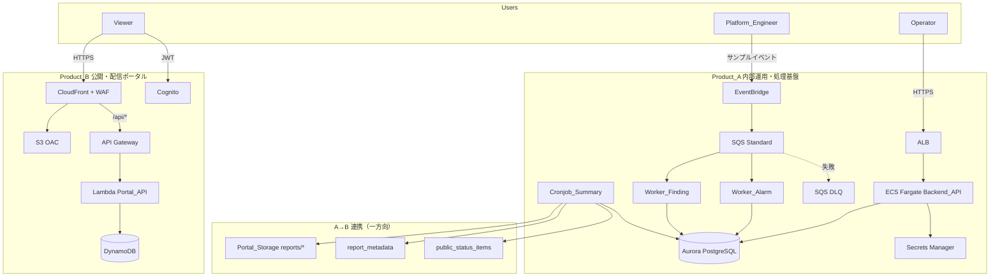

# アーキテクチャ概要

本書は design.md の「Overview / Architecture」を要約し、主要な設計判断の理由を記載する（Req 26.2, 26.3）。

## 全体像

疎結合な 2 成果物を AWS 上に構築し、**A→B の一方向・非同期連携のみ**を許容する（Req 1, 14）。

- **Product_A（内部運用・処理基盤）**: ECS Fargate（同期 API）、EKS（非同期ワーカー / CronJob）、Aurora PostgreSQL（永続化）。Operator が運用データを管理する。
- **Product_B（公開・配信ポータル）**: CloudFront + S3(OAC) + WAF + Cognito + API Gateway + Lambda + DynamoDB。Viewer が閲覧する軽量ポータル。

環境は dev/MVP、リージョンは `ap-northeast-1`、命名規則は `ops-platform-dev-<resource>`、全リソースへ識別タグを付与する（Req 19）。

## システム全体図（要約）

> **重要**: A→B 連携の実行主体は MVP では **Cronjob_Summary（`monthly-summary-cronjob`）に限定**する。Backend_API から Portal_DB / Portal_Storage への直接書き込み経路は持たない。

## 分離の設計思想（なぜ統合しないか）

Product_A は「状態を持ち処理を行う内部基盤」、Product_B は「静的・軽量・公開の閲覧ポータル」という性質の異なる 2 系統である。独立してビルド・デプロイ・スケール・障害対応できるよう疎結合とし、一方の障害が他方へ波及しないようにする。連携は A→B の一方向データ受け渡し（Req 14.3）に限定し、B→A の書き込みは設計上排除する。

## ECS / EKS / CloudFront を分ける理由（3 基盤の性質差）

| 基盤 | 責務 | 選定理由 |
| --- | --- | --- |
| ECS Fargate | 同期 API（リクエスト/レスポンス型） | 低レイテンシの常駐サービス。ALB 配下のシンプルなコンテナ実行に最適で運用負荷が低い。 |
| EKS（Fargate Profile） | 非同期ワーカー / 定期ジョブ | キュー駆動・CronJob・複数種ワーカーのオーケストレーションに適する。実運用に近いイベント駆動処理を再現。 |
| CloudFront | 公開エッジ配信 | 静的コンテンツのエッジ配信・WAF によるエッジ保護に特化し、公開性と低コスト配信を担う。 |

「同期 API」「非同期処理基盤」「エッジ配信」という異なる責務を、それぞれ最適なサービスへ割り当てる。

## ECS と EKS の役割分担

- **ECS Fargate（Backend_API）**: Operator の API 呼び出しに対する同期処理。ダッシュボード / インシデント / Finding / 月次集計 API。書き込み先は Aurora。
- **EKS（ワーカー群）**: EventBridge→SQS 駆動の非同期処理と CronJob。alarm_events 取込 / findings 分類 / 月次集計生成。Aurora への取込・集計と、Cronjob_Summary のみが A→B 連携を行う。

## A→B 連携フロー（要約）

Cronjob_Summary が月次集計を確定すると、(1) レポートファイルを Portal_Storage(`reports/*`) へ配置、(2) メタ情報を `report_metadata` へ登録、(3) 公開ステータスを `public_status_items` へ反映する。非同期・冪等（`period` / `external_id` UNIQUE）のため再実行で安全に回復できる。

## 関連ドキュメント

- Terraform 構成: [terraform-structure.md](terraform-structure.md)
- state backend: [terraform-backend-design.md](terraform-backend-design.md)
- DB 設計: [../db/db-design.md](../db/db-design.md)
- API 設計: [../api/api-design.md](../api/api-design.md)
