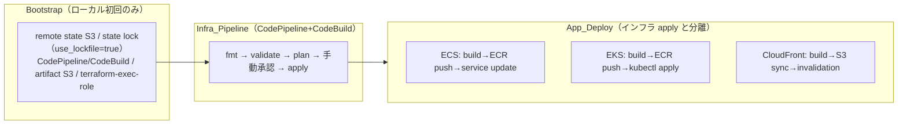

# デプロイ設計（3 層分離）

design.md の「デプロイ設計」を要約する（Req 20〜23, 26.2）。

## 分離理由

- **Bootstrap 分離**: パイプラインを作るための state / 権限をパイプライン自身で作れない鶏卵問題を回避するため、初回のみローカルで土台を作る。
- **アプリ / インフラ apply 分離**: インフラは変更頻度が低く影響が大きい、アプリは変更頻度が高く影響が局所的、という性質差に合わせ、独立して安全にリリースするため分離する（Req 22.1）。

詳細: [cicd-design.md](cicd-design.md)（Infra_Pipeline）、[app-deployment-design.md](app-deployment-design.md)（App_Deploy）、backend/state は [../architecture/terraform-backend-design.md](../architecture/terraform-backend-design.md)。
