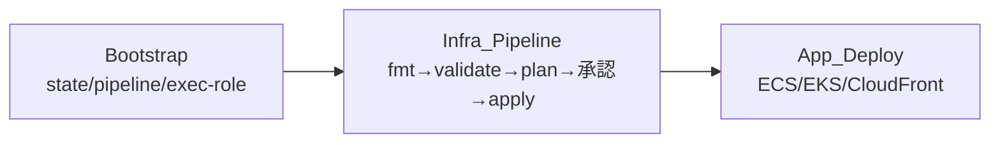

# 運用ドキュメント

design.md の「デプロイ設計 / 監視設計」を要約する（Req 26.2, 26.3）。詳細は関連ドキュメントを参照。

## デプロイ 3 層分離

- **Bootstrap（ローカル初回のみ）**: remote state S3、state lock（`use_lockfile=true` 第一候補）、CodePipeline / CodeBuild、artifact S3、terraform-exec-role を作成。パイプライン自身を作る鶏卵問題を回避するため初回だけローカルで実行する。
- **Infra_Pipeline**: main への merge/push で起動。`fmt → validate → plan → 手動承認 → apply` の順。plan で作成/変更/削除一覧とコスト影響大リソースを明示し、**承認なしでは apply しない**（Req 21, 23）。
- **App_Deploy（インフラ apply と分離）**: ECS（build→ECR push→service update）、EKS（build→ECR push→`kubectl apply`）、CloudFront（build→S3 sync→invalidation）。インフラは変更頻度が低く影響大、アプリは変更頻度が高く影響が局所的、という性質差に合わせて分離する（Req 22）。

詳細: [deployment-design.md](deployment-design.md) / [app-deployment-design.md](app-deployment-design.md) / [cicd-design.md](cicd-design.md) / [implementation-plan.md](implementation-plan.md)。

## 監視

- **CloudWatch Alarms**: SQS DLQ>0、ECS CPU/Mem/タスク数、ALB 5xx/レイテンシ、Lambda Errors/Throttles/Duration、Aurora ACU/接続数。
- **Dashboards**: Product_A / Product_B を分離した 2 ダッシュボード。
- **通知**: SNS トピック経由。
- 本番向け（設計含有・MVP 最小/無効）: X-Ray、Container Insights、Aurora Performance Insights。

## デモシナリオ（プレースホルダ）

> Task 19.2 で詳細化する。以下は骨子。

1. サンプルイベント投入（EventBridge/SQS）→ Worker_Alarm / Worker_Finding が Aurora へ取込。
2. Backend_API でダッシュボード / インシデント / Finding / 月次集計を確認。
3. Cronjob_Summary 実行 → monthly_summaries 生成 → A→B 連携で Portal へ反映。
4. Viewer が Cognito ログイン → CloudFront 経由でステータス / レポート閲覧。
5. DLQ / Alarm / 監査ログの確認。

## スケーリング（MVP 非必須）

ECS Auto Scaling / EKS HPA は設計に含めるが MVP では無効/最小/非必須とする（Req 25）。
