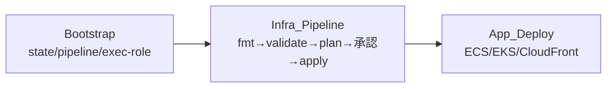

# 運用ドキュメント

design.md の「デプロイ設計 / 監視設計」を要約する（Req 26.2, 26.3）。詳細は関連ドキュメントを参照。

## デプロイ 3 層分離



- **Bootstrap（ローカル初回のみ）**: remote state S3、state lock（`use_lockfile=true` 第一候補）、CodePipeline / CodeBuild、artifact S3、terraform-exec-role を作成。パイプライン自身を作る鶏卵問題を回避するため初回だけローカルで実行する。
- **Infra_Pipeline**: main への merge/push で起動。`fmt → validate → plan → 手動承認 → apply` の順。plan で作成/変更/削除一覧とコスト影響大リソースを明示し、**承認なしでは apply しない**（Req 21, 23）。
- **App_Deploy（インフラ apply と分離）**: ECS（build→ECR push→service update）、EKS（build→ECR push→`kubectl apply`）、CloudFront（build→S3 sync→invalidation）。インフラは変更頻度が低く影響大、アプリは変更頻度が高く影響が局所的、という性質差に合わせて分離する（Req 22）。

詳細: [deployment-design.md](deployment-design.md) / [app-deployment-design.md](app-deployment-design.md) / [cicd-design.md](cicd-design.md) / [implementation-plan.md](implementation-plan.md)。

## 監視

- **CloudWatch Alarms**: SQS DLQ>0、ECS CPU/Mem/タスク数、ALB 5xx/レイテンシ、Lambda Errors/Throttles/Duration、Aurora ACU/接続数。
- **Dashboards**: Product_A / Product_B を分離した 2 ダッシュボード。
- **通知**: SNS トピック経由。
- 本番向け（設計含有・MVP 最小/無効）: X-Ray、Container Insights、Aurora Performance Insights。

## デモシナリオ

実装済みの seed スクリプト（Task 18.1）・App_Deploy スクリプト（Task 19.1）・A→B 連携（Task 16.2）を通しで動かすシナリオ。seed/deploy スクリプトは**既定 dry-run**で、実投入は `--execute` を明示したときのみ。

1. **サンプルアラーム投入**: ダミーのアラーム風イベントを EventBridge（→SQS）へ投入する。まず dry-run で内容確認、次に実投入。
   ```bash
   python3 scripts/seed_alarm_events.py            # dry-run（既定）
   python3 scripts/seed_alarm_events.py --execute  # 実投入
   # 併せて Finding 風イベントも投入する場合
   python3 scripts/seed_finding_events.py --execute --count 5
   ```
2. **Worker 取込**: `alarm-event-processor` が SQS からアラームを取得し `alarm_events` へ冪等 upsert、`security-finding-worker` が `findings` / `finding_triage` へ整合登録する（同一 `external_id` は重複しない）。
3. **Backend API 確認**: `GET /dashboard/summary` で incident/finding 件数と status_breakdown を確認。`GET /incidents`・`GET /findings` で一覧、`GET /incidents/{id}` で詳細を確認。状態変更（`PATCH /incidents/{id}/status`）で `audit_logs` に 1 件記録されることを確認。
4. **月次集計**: `monthly-summary-cronjob` が対象期間の incidents/findings/alarm_events を集計し `monthly_summaries` へ `period` UNIQUE で upsert。再実行しても 1 行（最新値更新）。
5. **A→B 連携**: 同 CronJob が Portal_Storage(`reports/<period>/summary.json`) へレポート配置、`report_metadata` 登録、`public_status_items` 反映（非機微・ダミーのみ、B→A 書き込みなし）。Portal 側の初期データは以下でシード可能。
   ```bash
   python3 scripts/seed_portal_reports.py --execute \
     --report-metadata-table ops-platform-dev-report-metadata \
     --public-status-table  ops-platform-dev-public-status-items \
     --reports-bucket       ops-platform-dev-portal-REPLACE_WITH_SUFFIX
   ```
6. **Status Portal 閲覧**: Viewer が Cognito ログイン → CloudFront 経由で `GET /api/status(/{id})`・`GET /api/reports(/{id})` を閲覧。閲覧ごとに `page_view_logs` が 1 件増加、`public_status_items` 本体は不変。
7. **監視アラーム確認**: `infra/modules/monitoring` の Alarm（DLQ>0 / ECS / ALB / Lambda / Aurora）と A/B 分離 2 ダッシュボード、SNS 通知、`audit_logs` の記録を確認。

> App のデプロイ自体を試す場合は `scripts/deploy-ecs.sh` / `deploy-eks.sh` / `deploy-frontend.sh`（既定 dry-run、`--execute` で実行）を使う。App_Deploy はインフラ apply と分離し、terraform は呼ばない。

## スケーリング（MVP 非必須）

ECS Auto Scaling / EKS HPA は設計に含めるが MVP では無効/最小/非必須とする（Req 25）。
